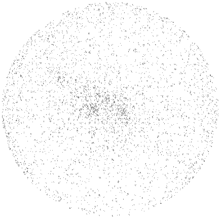
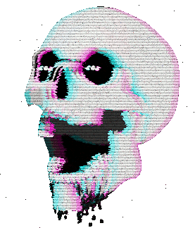

<p align="left">
    <a href="#">
        
    </a>
    <a href="#">
        
    </a>
    <a href="#">
        
    </a>
</p>

# 𝙷𝚒 𝙸'𝚖 Estevam <a href="#"></a>

### Software Engineer in formation | 𝙲𝚛𝚎𝚊𝚝𝚒𝚟𝚎 𝙳𝚎𝚟𝚎𝚕𝚘𝚙𝚎𝚛 | 𝙿𝚊𝚜𝚜𝚒𝚘𝚗𝚊𝚝𝚎 𝚊𝚋𝚘𝚞𝚝 𝙳𝚊𝚝𝚊 𝚂𝚌𝚒𝚎𝚗𝚌𝚎 & Backend Developer

or so I'd like to think 😂

Trying to simultaneously learn heaps and cook up cool projects.

#

<br/>
<p align="center">
    <a href="#">
        
    </a>
    <a href="#">
        
    </a>
    <a href="#">
        
    </a>
</p>

### Follow Me:

<p align="center">
    <a href="https://vikash.ch/" rel="nofollow">
        
    </a>
    <a href="https://www.linkedin.com/in/vikash-chand-fiji" rel="nofollow">
        
    </a>
</p>


<!-- TODO: Add latest work link - Vikash -->

- 💎 Currently trying to find time to learn more and work on
  - Full-Stack
    - Machine Learning
    - AI
    - JavaScript
    - Python
    - and Flutter projects
  - and contribute more to open source, so stay tuned!
- ⚡ Fun facts:
  - I like my beers cold 🍺 and the whiskey old 🥃

### Top Tools & Technologies:
<!-- TODO: Update the rest of the as badges as below - Vikash -->

<p align="center">
    <a href="#">
        
    </a>
    <a href="#">
        
    </a>
    <a href="#">
        
    </a>
    <a href="#">
        
    </a>
    <a href="#">
        
    </a>
    <a href="#">
        
    </a>
</p>

<!--
[](#)
-->

#

### 𝙼𝚘𝚛𝚎 𝚊𝚋𝚘𝚞𝚝 𝚖𝚎:

<details open>
    <summary>
    Languages and Tools I follow
    </summary>
    <br />
    <p align="center">
        <a href="#">
            
        </a>
        <br /><br />
        Programming Languages<br />
        <a
            href="https://developer.mozilla.org/en-US/docs/Web/JavaScript"
            target="_blank"
        >
            
        </a>
        <a href="https://www.python.org" target="_blank">
            
        </a>
        <a href="https://dart.dev" target="_blank">
            
        </a>
        <a href="https://www.w3schools.com/cs/" target="_blank">
            
        </a>
        <a href="https://www.php.net" target="_blank">
            
        </a>
        <br /><br />
        Frontend Development<br />
        <a href="https://www.w3.org/html/" target="_blank">
            
        </a>
        <a href="https://www.w3schools.com/css/" target="_blank">
            
        </a>
        <a href="https://reactjs.org/" target="_blank">
            
        </a>
        <a href="https://vuejs.org/" target="_blank">
            
        </a>
        <a href="https://sass-lang.com" target="_blank">
            
        </a>
        <a href="https://tailwindcss.com/" target="_blank">
            
        </a>
        <a href="https://bulma.io/" target="_blank">
            
        </a>
        <a href="https://getbootstrap.com" target="_blank">
            
        </a>
        <a href="https://angular.io" target="_blank">
            
        </a>
        <a href="https://webpack.js.org" target="_blank">
            
        </a>
        <br /><br />
        Backend Development<br />
        <a href="https://nodejs.org" target="_blank">
            
        </a>
        <a href="https://expressjs.com" target="_blank">
            
        </a>
        <a href="https://graphql.org" target="_blank">
            
        </a>
        <a href="https://www.nginx.com" target="_blank">
            
        </a>
        <br /><br />
        Mobile Development<br />
        <a href="https://flutter.dev" target="_blank">
            
        </a>
        <a href="https://reactnative.dev/" target="_blank">
            
        </a>
        <a href="https://ionicframework.com" target="_blank">
            
        </a>
        <br /><br />
        Static Site Generators<br />
        <a href="https://nextjs.org/" target="_blank">
            
        </a>
        <a href="https://www.gatsbyjs.com/" target="_blank">
            
        </a>
        <a href="https://nuxtjs.org/" target="_blank">
            
        </a>
        <br /><br />
        Frameworks<br />
        <a href="https://laravel.com/" target="_blank">
            
        </a>
        <a href="https://www.electronjs.org" target="_blank">
            
        </a>
        <a href="https://dotnet.microsoft.com/" target="_blank">
            
        </a>
        <br /><br />
        Databases<br />
        <a href="https://www.mongodb.com/" target="_blank">
            
        </a>
        <a href="https://mariadb.org/" target="_blank">
            
        </a>
        <a href="https://www.mysql.com/" target="_blank">
            
        </a>
        <a href="https://www.sqlite.org/" target="_blank">
            
        </a>
        <a href="https://www.postgresql.org" target="_blank">
            
        </a>
        <a href="https://hive.apache.org/" target="_blank">
            
        </a>
        <br /><br />
        ML/AI<br />
        <a href="https://www.tensorflow.org" target="_blank">
            
        </a>
        <a href="https://opencv.org/" target="_blank">
            
        </a>
        <br /><br />
        Data Visualization<br />
        <a href="https://d3js.org/" target="_blank">
            
        </a>
        <a href="https://www.chartjs.org" target="_blank">
            
        </a>
        <br /><br />
        Automation & Testing<br />
        <a href="https://github.com/puppeteer/puppeteer" target="_blank">
            
        </a>
        <br /><br />
        DevOps<br />
        <a href="https://www.gnu.org/software/bash/" target="_blank">
            
        </a>
        <a href="https://www.docker.com/" target="_blank">
            
        </a>
        <a href="https://cloud.google.com" target="_blank">
            
        </a>
        <a href="https://travis-ci.org" target="_blank">
            
        </a>
        <a href="https://circleci.com" target="_blank">
            
        </a>
        <br /><br />
        Backend as a Service(BaaS)<br />
        <a href="https://vercel.com/dashboard" target="_blank">
            
        </a>
        <a href="https://firebase.google.com/" target="_blank">
            
        </a>
        <a href="https://heroku.com" target="_blank">
            
        </a>
        <br /><br />
        Game Engines<br />
        <a href="https://unity.com/" target="_blank">
            
        </a>
        <br /><br />
        Others<br />
        <a href="https://www.linux.org/" target="_blank">
            
        </a>
        <a href="https://git-scm.com/" target="_blank">
            
        </a>
        <a href="https://www.arduino.cc/" target="_blank">
            
        </a>
        <br /><br />
        Softwares<br />
        <a href="https://www.photoshop.com/en" target="_blank">
            
        </a>
        <a
            href="https://www.adobe.com/products/photoshop-lightroom.html"
            target="_blank"
        >
            
        </a>
        <a
            href="https://www.adobe.com/in/products/illustrator.html"
            target="_blank"
        >
            
        </a>
        <a href="https://www.adobe.com/products/xd.html" target="_blank">
            
        </a>
        <a href="https://www.figma.com/" target="_blank">
            
        </a>
        <a href="https://www.framer.com/" target="_blank">
            
        </a>
        <a href="https://www.blender.org/" target="_blank">
            
        </a>
        <a href="https://postman.com" target="_blank">
            
        </a>
        <a href="https://www.mathworks.com/" target="_blank">
            
        </a>
    </p>
</details>

<!--
 
-->

#

### ➜ Bizness

- 📑 [My Resume / CV](./resume/VikashChand_resume.pdf) <a href="#"></a> _updated [10/05/2021]_

<p align="left">
    <a href="#">
        
    </a>
    <a href="#">
        
    </a>
    <a href="#">
        
    </a>
</p>

_Latest 5 from a playlist I'm currently listening to for those late night coding sessions_
<!-- YouTube:START -->
- [Adrenaline - Hard Grunge Trap Type Beat (FREE FOR PROFIT USE)](https://www.youtube.com/watch?v=zdOhb2qB6k0)
- [Mortal - Alt Rock/Trap Beat / Prod. Riddiman x Joe Leytrick (FREE FOR PROFIT USE)](https://www.youtube.com/watch?v=8kvCH48h0bU)
- [Chaos - Alt Rock/Trap Beat / Prod. Riddiman x Joe Leytrick (FREE FOR PROFIT USE)](https://www.youtube.com/watch?v=9TR2MxROuD8)
- [Cut Deep - Trap/RnB Style Hip Hop Beat (FREE FOR PROFIT USE)](https://www.youtube.com/watch?v=1-dOyi5OwGE)
- [Warrior - Hard Minimalist Japanese Style Trap Beat (FREE FOR PROFIT USE)](https://www.youtube.com/watch?v=LvHHBRL5I1M)
<!-- YouTube:END -->
_Stay focused!_

<!--
<br />

<details>
    <summary>
        Stats
    </summary>

    <br >

    #### Github Stats

    

</details>
-->


```
▬▬▬▬.◙.▬▬▬▬
  ▂▄▄▓▄▄▂                                                        ╫►►        ▁▁ ▓
◢◤ █▀▀████▄▄▄▄▄▄▄◢◤            ● ● ● ▄▄▄▄▄▄▄████▮                ╫       █████████
█  NATEE'S GITHUB █▀▀▀▀╬            ▂▃▄▅████▀▀▀████▅▄            ╫    ▟██⍁██⍁██⍁███▙
◥█████████◤                       ▄█████ FRONTEND █████▄       ▜████ LEARN PYTHON ████▛
══╩════╩══                         ◥⊙▲⊙▲⊙▲⊙▲⊙▲⊙▲⊙▲⊙▲⊙▲◤         ▜███████████████████▛╬
░░░░░░░░░░░░░░░░░░░░░░░░░░░░░░░░░░░░░░░░░░░░░░░░░░░░░░░░░░░░░░░░░░░░░░░░░░░░░░░░░░░░░░░░░░░
```


<p>
  
</p>


---
### :volcano: Funny Joke

> "Have you heard about the object-oriented way to become wealthy?"
>> "No..."
>>> "Inheritance!"

> "Why all Pascal programmers ask to live in Atlantis?"
>> "Because it is below C level."

---

<h2 align="center">
    My Soft Skills:
</h2>


- **Responsive ✅**
- **Intuitive 🤩**
- **Dynamic 🧬**
- **Reusable ♻️**
- **Secure 🛡️**
- **Load blazing fast 🚀**
- **SEO Optimized 🔍**
- **Crafted with pixel-perfect code ✨**


<br/>
<br/>


<a href="#">
  
</a>

## I'm a Machine Learning/Deep Learning Enthusiast!

- I’m currently working on building my knowledge in the field of Data Science!
  - Learning Computer Vision, Natural Language Processing
  - Learning how to deploy Machine Learning/Deep Learning Models
  - Reading papers on ML/DL/AI
- I’m currently learning : 
  - Deep Learning for Coders by [fast.ai](http://course.fast.ai)
  - DeepLearning.AI TensorFlow Developer
  - Hands-On Machine Learning with Scikit-Learn, Keras, and TensorFlow [Book](https://www.oreilly.com/library/view/hands-on-machine-learning/9781492032632/)
- I’m looking to collaborate with other content creators
- 2020/2021 Goals: Contribute more to Open Source projects
- Fun fact: I have a degree in Civil Engineering! :construction_worker:
<br />


<div>
  <h1 align="center"> 
    <strong> I am <mark>Srishti Singh</mark></strong>
    <br> <strong> I’m currently learning  Machine Learning   and brushing up my basics. </strong>
    <br> <strong> I believe in learning anything the FeYmAnN WaY :writing_hand: :arrows_counterclockwise: :woman_teacher:</strong> 
  </h1>
</div>

---

<div>
  <div align="right">
    
  </div>
  
  <div align="left">
    <p align="center">  
      <h3 align="center">
        
        
        
        
        
        
      </h3>
      <p align="center"></p>
      <p align="center">
        <code><a href="https://www.python.org/" target="_blank"></a></code>
        <code><a href="https://jupyter.org/" target="_blank"></a></code>
        <code><a href="https://numpy.org/" target="_blank"></a></code>
        <code><a href="https://pandas.pydata.org/" target="_blank"></a></code>
        <code><a href="https://matplotlib.org/" target="_blank"></a></code>
        <code><a href="" target="_blank"></a></code>
      </p>
    </p>
   </div>
 </div>
  
---

<div>
<p align="left">
  
   
  
</p></div>
<br>

---

<p align="center">
  
  
  
  
  
  
  
  
  
  
  
  
  
  
  
  
  
  
  
  
  
  
  
  
  
</p>

<h3 align="center">THRIVING TO GET BIGGER, BETTER & STRONGER EVERYDAY</h3>
<!-- For making transition -->
<p align="center">


</p>

<p align="center">
  
  
  
  
  
  
  
  
  
  
  
  
  
  
  
  
  
  
  
  
  
  
  
  
  
</p>


## ⭐️ From [@Estevam](https://github.com/Estevamsl) 
<h3 align="right">Appreciate your feedbacks </h3>


<p align="center">
    
</p>


<details>
  <summary><b>How to reach me </b></summary>
<p align="center">
<a href="https://codepen.io/estevamsl" target="blank"></a>
<a href="https://stackshare.io/estevamsl" target="blank"></a>
<a href="https://www.npmjs.com/~estevamsl" target="blank"></a>
<a href="https://www.canva.com" target="blank"></a>
<a href="https://app.circleci.com/pipelines/github/Estevamsl" target="blank"></a>
<a href="https://dashboard.heroku.com/Estevamsl" target="blank"></a>
<a href="https://bitbucket.org/Estevamsl" target="blank"></a>
<a href="https://gitlab.com/Estevamsl" target="blank"></a>
<a href="https://img.shields.io/badge/-estevamsouzalaureth@gmail.com-6633cc?style=flat-square&logo=Gmail&logoColor=white&link=mailto:estevamsouzalaureth@gmail.com" target="blank"></a>
<a href="https://stackoverflow.com/users/14758561/estevam-souza-laureth" target="blank"></a>
<a href="https://codesandbox.com/estevamsl" target="blank"></a>
</p>

[](https://api.whatsapp.com/send?phone=55+48+988338777)
[](mailto:estevamsouzalaureth@gmail.com)
[](https://)
[](https://)
<a href="https://medium.com/@estevamsouzalaureth"></a>
<a href="https://www.linkedin.com/in/estevam-souza-3b0559176//"></a>
<a href="https://github.com/Estevamsl"></a>
[](https://www.codewars.com/users/Estevamsl/published_kumite)
[](https://gist.github.com/Estevamsl/4a5686784f42207c4db7db828a3fbe2e)
[](mailto:estevamsouzalaureth@hotmail.com)
<a href="https://dev.to/estevamsl">
  
</a>
[](https://)
<br />
<a href="https://github.com/Estevamsl" target="_blank">
  
</a>
<a href="https://github.com/Estevamsl" target="_blank">
  
</a>
<a href="https://www.linkedin.com/in/estevam-souza-3b0559176//" target="_blank">
  
</a>

<br />
<p align="left">
  
</p>
	
</details>

<details>
  <summary align="center"> :eyes::eyes: My Playlist no Spotify  </summary>


<!-- Nothing weird to see here -->
<p align="center">
  <a href="https://open.spotify.com/playlist/2IhnkmwsaJgpkDX8YlYyf6">
    <!-- Music bars move to the beat and are colored based on the track's happiness, danceability and energy! -->
    
  </a>
</p>

<p align="center">
	
[](https://open.spotify.com/playlist/2IhnkmwsaJgpkDX8YlYyf6)

</p>

</details>
</details>
</details>


<!--
**halfrost/halfrost** is a ✨ _special_ ✨ repository because its `README.md` (this file) appears on your GitHub profile.

Here are some ideas to get you started:

- 🔭 I’m currently working on ...
- 🌱 I’m currently learning ...
- 👯 I’m looking to collaborate on ...
- 🤔 I’m looking for help with ...
- 💬 Ask me about ...
- 📫 How to reach me: ...
- 😄 Pronouns: ...
- ⚡ Fun fact: ...


// Github Status

<details>
  <summary>Some other achievements about me~e~e</summary>
  <br>

* 🎉   Professional Membership of ACM / IEEE / IEEE-CS / CCF.
* 🍎   Apple Developer.👨🏻‍💻 & Apple Teacher.🤪

<p align="center">
<a href= "https://img.halfrost.com/certificate/ACM_memcert0104000A02030A_00.pdf"></a>
<a href= "https://img.halfrost.com/certificate/IEEE_MEMIEEE500_97002879_2021.pdf"></a>
<a href= "https://img.halfrost.com/certificate/IEEE_CS_MEMC016_97002879_2021.pdf"></a>

<a href= "https://img.halfrost.com/certificate/AppleTeacher.pdf"></a>
</p>

* 👑   Some GitHub statistical reports:

<p align="center">


</p>

</details>
 
 
// Skills


### 🛠️ Languages and Tools:


### 👣 Next Steps

_Since you don't want to leave my profile just yet! Here are some things you can do :_

// My Configuration


[](https://www.youtube.com/watch?v=D00hlkW0u3U)

[](#)


[](https://github.com/vn7n24fzkq/github-profile-summary-cards)<br/>
[](https://github.com/vn7n24fzkq/github-profile-summary-cards)
[](https://github.com/vn7n24fzkq/github-profile-summary-cards)


💻 **I'm interested in**
<p align="center">
    
    
    
    
    
</p>

**Desenvolvedor Back End apaixonado pelas novas tecnologias que a programação nos proporciona! **


<br />
<br />


[![bmc][buymeacoffee-shield]][buymeacoffee]

[buymeacoffee]: https://www.buymeacoffee.com/estevamsl
[buymeacoffee-shield]: https://www.buymeacoffee.com/assets/img/custom_images/yellow_img.png


```js
  const importantLinks = {
    📒 Linkedin: 'https://www.linkedin.com/in/estevam-souza/', 
    👋 Email: 'estevamsouzalaureth@gmail.com',
  }e
```
<p align="center">
    
</p>

<h3> </h3>

<p align="center" ></p>
 
 ```javascript
const EstevamSouza = {
  hobbies: [Iot, Rockets, Mechanics, Astronomy],
  code: [Javascript, C++, Html, Css, Python, Php],
  frameworks: [],
  tools: [Figma, VSCODE],
  techCommunities: {
                        frontent: "Ukecode",
                        cofounder: "SpaceMonkeys",
                      },
}

```

<hr />
<details>
  <summary align="center"> :eyes: More Information :warning: </summary>


<details>
<summary align="center">
  More stuff about me 
</summary>

### What I do

I do Open Source. In fact, I do Open Source so much, that 95% of my work on
GitHub is free and open to everyone. I am really passionate about doing web
development, it is in my opinion the best combination of logical programming and
(sometimes) beautiful design.

## My skills 📜

### Web technologies

- JavaScript
  ([LinkedIn Assesments Certified](https://www.linkedin.com/in/filiptronicek/))
- TypeScript
- HTML, CSS
  ([Microsoft Certified](https://www.youracclaim.com/badges/6d5a4a58-c895-4d7e-a725-db1441e9d979/public_url))
- SCSS
- Node.js ([LinkedIn Assesments Certified](https://www.linkedin.com/in/filiptronicek/))
- Deno
- WordPress
  ([LinkedIn Assesments Certified](https://www.linkedin.com/in/filiptronicek/))
- PHP
- MySQL
- Microsoft Azure ([AZ 900 Certification](https://www.credly.com/badges/1da5ef87-dc8f-4aeb-8870-c19d0e020895/public_url))

### Application Development

- Python ([Microsoft Certified](https://www.youracclaim.com/badges/46b260a8-ef2c-41a3-9f61-aa0920eab84a/public_url))
- C++ (sort of)

### Productivity utilities

- Microsoft Office - I am a Certified
  [Excel](https://www.youracclaim.com/badges/36154164-82b5-4fbf-b65c-c152af720245/public_url)
  and
  [Word](https://www.youracclaim.com/badges/6f4eee1d-3379-4a8b-b846-35762708d4b8/public_url)
  Expert

### Languages 🌐

| Language      | Proficiency                                                               |
| ------------- | ------------------------------------------------------------------------- |
| English (duh) | C2 ([EFSET certified](https://www.efset.org/cert/5P5Pp1))                 |
| German        | B1 ([DSD Certificate](https://www.goethe.de/en/spr/kup/prf/prf/gb1.html)) |
| Czech         | Native language                                                           |

## What I'm currently learning 📚

- React.js
- React Native
- Next.js
- Ruby

## Projects I'm the most proud of

| Name            | Description                                                          | Language      | Repo                                                             |
| --------------- | -------------------------------------------------------------------- | ------------- | ---------------------------------------------------------------- |
| Interclip       | A clipboard and file sharing tool                                    | PHP           | [aperta-principium/Interclip](https://s.trnck.dev/interclip-git) |
| Open Sauced     | 🍕 This is a project to identify your next open source contribution. | JS / React.js | [open-sauced/open-sauced](https://s.trnck.dev/sauced-git)        |
| gitpy           | A Python wrapper for git                                             | Python        | [filiptronicek/gitpy](https://s.trnck.dev/gitpy)                 |
| Dataset Creator | Simple Flickr Image Scraper and compression script                   | Python        | [filiptronicek/dataset-creator](https://s.trnck.dev/a831c)       |

## In the works

Stuff that is looking forward to be shipped :shipit: 
| Name of project | Current State | Version |
|-----------------|---------------|---------|
|[Interclip mobile](https://github.com/filiptronicek/iclip-mobile) | Shipping MVP | [v0.2.2](https://github.com/filiptronicek/iclip-mobile/releases/tag/v0.2.2) |
|[Open Sauced](https://github.com/open-sauced/open-sauced/) | Fixing bugs and adding key features | [v0.18.5](https://github.com/open-sauced/open-sauced/releases/tag/v0.18.5) |
| [Taskord mobile](https://github.com/filiptronicek/taskord-mobile/) | Trying to get to MVP | -no release yet-

## My own dictionary 📕:

| Word / abreviation | Meaning                                                | Note                                             |
| ------------------ | ------------------------------------------------------ | ------------------------------------------------ |
| FFO                | Fífa Friendly Office (a place where I can work safely) | Idea by [@aellopos](https://github.com/aellopos) |

## Website subdomains 🔌

My website has quite a few of them, here's a list of the public ones:

- [thanks.trnck.dev](https://thanks.trnck.dev) - my thanks page to my sponsors
- [status.trnck.dev](https://status.trnck.dev) - status page for my sites
- [btc.trnck.dev](https://btc.trnck.dev) - track the price of Bitcoin - data
  from [filiptronicek/btc-tracker](https://github.com/filiptronicek/btc-tracker)
- [qr.trnck.dev](https://qr.trnck.dev) - create a QR code in 2 seconds
</details>


<!-- Details Section-->
<details>
  <summary align="center"><b>Portfolio </b></summary>

</details>

<!-- Details Section-->
<details>
  <summary align="center"><b>Currículo Status </b></summary>


<div align="center">
	<br>
	<br>
	
	<p><strong>We're having a really bad day.</strong></p>
	<p>The Unicorns have taken over. We're doing our best to get them under control and get GitHub back up and running.</p>
	<div id="suggestions">
	<a href="https://www.youtube.com/watch?v=dQw4w9WgXcQ">Contact Support</a> —
	<a href="https://www.youtube.com/watch?v=dQw4w9WgXcQ">GitHub Status</a> —
	<a href="https://www.youtube.com/watch?v=dQw4w9WgXcQ">@githubstatus</a>
	</div>
</div>


Currently working on [Datasette](https://datasette.io/) and associated projects. Read [my blog](https://simonwillison.net/) or [follow @simonw on Twitter](https://twitter.com/simonw).

<table><tr><td valign="top" width="33%">

### Recent releases
<!-- recent_releases starts -->
[django-sql-dashboard 0.13](https://github.com/simonw/django-sql-dashboard/releases/tag/0.13) - 2021-05-10

[json-post 0.2](https://github.com/simonw/json-post/releases/tag/0.2) - 2021-04-11

[airtable-export 0.7.1](https://github.com/simonw/airtable-export/releases/tag/0.7.1) - 2021-04-09

[datasette 0.56](https://github.com/simonw/datasette/releases/tag/0.56) - 2021-03-29

[datasette-publish-azure 0.1a0](https://github.com/simonw/datasette-publish-azure/releases/tag/0.1a0) - 2021-03-28

[datasette-publish-vercel 0.9.3](https://github.com/simonw/datasette-publish-vercel/releases/tag/0.9.3) - 2021-03-26

[sqlite-transform 0.5](https://github.com/simonw/sqlite-transform/releases/tag/0.5) - 2021-03-24

[iam-to-sqlite 0.1](https://github.com/simonw/iam-to-sqlite/releases/tag/0.1) - 2021-03-24
<!-- recent_releases ends -->
More [recent releases](https://github.com/simonw/simonw/blob/main/releases.md)
</td><td valign="top" width="34%">

### On my blog
<!-- blog starts -->
[Django SQL Dashboard](http://simonwillison.net/2021/May/10/django-sql-dashboard/) - 2021-05-10

[Adding GeoDjango to an existing Django project](http://simonwillison.net/2021/May/3/adding-geodjango-to-an-existing-django-project/) - 2021-05-03

[One year of TILs](http://simonwillison.net/2021/May/2/one-year-of-tils/) - 2021-05-02

[Weeknotes: Vaccinate The States, and how I learned that returning dozens of MB of JSON works just fine these days](http://simonwillison.net/2021/Apr/26/vaccinate-the-states/) - 2021-04-26

[Weeknotes: The Aftermath](http://simonwillison.net/2021/Apr/18/weeknotes-the-aftermath/) - 2021-04-18
<!-- blog ends -->
More on [simonwillison.net](https://simonwillison.net/)
</td><td valign="top" width="33%">

### TIL
<!-- tils starts -->
[Scroll page to form if there are errors](https://til.simonwillison.net/javascript/scroll-to-form-if-errors) - 2021-05-08

[Running Datasette on Replit](https://til.simonwillison.net/datasette/datasette-on-replit) - 2021-05-02

[migrations.RunSQL.noop for reversible SQL migrations](https://til.simonwillison.net/django/migrations-runsql-noop) - 2021-05-02

[Django Admin action for exporting selected rows as CSV](https://til.simonwillison.net/django/export-csv-from-django-admin) - 2021-04-26

[Constructing GeoJSON in PostgreSQL](https://til.simonwillison.net/postgresql/constructing-geojson-in-postgresql) - 2021-04-24
<!-- tils ends -->
More on [til.simonwillison.net](https://til.simonwillison.net/)
</td></tr></table>

<a href="https://github.com/simonw/simonw/actions"></a> <a href="https://simonwillison.net/2020/Jul/10/self-updating-profile-readme/">How this works</a>

	
.jpeg)
</details>

<!-- Details Section-->
<details>
  <summary align="center"><b>Certificações Status </b></summary>
	

```             k;double sin()
         ,cos();main(){float A=
       0,B=0,i,j,z[1760];char b[
     1760];printf("\x1b[2J");for(;;
  ){memset(b,32,1760);memset(z,0,7040)
  ;for(j=0;6.28>j;j+=0.07)for(i=0;6.28
 >i;i+=0.02){float c=sin(i),d=cos(j),e=
 sin(A),f=sin(j),g=cos(A),h=d+2,D=1/(c*
 h*e+f*g+5),l=cos      (i),m=cos(B),n=s\
in(B),t=c*h*g-f*        e;int x=40+30*D*
(l*h*m-t*n),y=            12+15*D*(l*h*n
+t*m),o=x+80*y,          N=8*((f*e-c*d*g
 )*m-c*d*e-f*g-l        *d*n);if(22>y&&
 y>0&&x>0&&80>x&&D>z[o]){z[o]=D;;;b[o]=
 ".,-~:;=!*#$@"[N>0?N:0];}}/*#****!!-*/
  printf("\x1b[H");for(k=0;1761>k;k++)
   putchar(k%80?b[k]:10);A+=0.04;B+=
     0.02;}}/*****####*******!!=;:~
       ~::==!!!**********!!!==::-
         .,~~;;;========;;;:~-.
             ..,--------,*/
```   

	
	### 👨‍💻 Projetos realizados:

|                           Nome                            |                         Tecnologia                          | Descrição                                                    |
| :----------------------------------------------------------: | :----------------------------------------------------------: | ------------------------------------------------------------ |
|   [I-SHOP](https://andersonleite.dev.br/projects/i-shop/)    |     [GitHub](https://github.com/andersonleite1/i-shop/)      | Esse projeto surgiu de um vídeo no youtube cujo objetivo era criar um tema para um e-commerce. |
| [SNAKE GAME](https://andersonleite.dev.br/projects/Recreating-the-snake-game-with-JavaScript/) | [GitHub](https://github.com/andersonleite1/courses-dio/tree/main/Recreating-the-snake-game-with-JavaScript) | Esse projeto faz parte do bootcamp HTML Web Developer da [DIO](https://web.digitalinnovation.one/), no final do projeto decidir da um visual retrô para o jogo e adicionar novas funcionalidades. |
| [Recriando a página inicial do Instagram](https://andersonleite.dev.br/projects/Recreating-the-Instagram-homepage/) | [GitHub](https://github.com/andersonleite1/courses-dio/tree/main/Recreating-the-Instagram-homepage) | Esse projeto faz parte do bootcamp HTML Web Developer da [DIO](https://web.digitalinnovation.one/), no final do projeto adicionei um ícone de lâmpada para os usuários escolherem entre ligth e dark. Também adicionei alguns efeitos aos botões de login e logout. |
|                        NETFLIX Clone                         | [GitHub](https://github.com/andersonleite1/courses-dio/tree/main/Recreating-the-Netflix-Interface) | Esse projeto faz parte do bootcamp HTML Web Developer da [DIO](https://web.digitalinnovation.one/), ainda não fiz alterações da versão original desenvolvida no bootcamp mais estou matutando pra saber o que posso fazer de diferente. |
| [Game Catch Bees](https://andersonleite.dev.br/projects/game-catch-bees/) |    [GitHub](https://github.com/andersonleite1/catch-bees)    | Esse projeto foi desenvolvido durante o curso que realizei na [Udemy](https://www.udemy.com/course/web-completo/), a versão original desenvolvida no curso era um jogo de matar moscas fiz algumas alterações e criei essa versão de capturar abelhas. |
|          [Calculadora IMC](http://calcular-imc.cf/)          | [GitHub](https://github.com/andersonleite1/calculadora-imc)  | Esse projeto foi desenvolvido durante o curso que realizei na [Udemy](https://www.udemy.com/course/curso-de-javascript-moderno-do-basico-ao-avancado/), é um projeto relativamente simples mas fiquei muito contente com o resultado final. |
|                                                              |                                                              |                                                              |


- [Lógica de Programação](https://certificates.digitalinnovation.one/FC1E7DFD)
- [Introdução ao Git e Controle de Versões](https://certificates.digitalinnovation.one/8E76B779)
- [Introdução ao GitHub e comandos essenciais para trabalhar em equipe](https://certificates.digitalinnovation.one/D823CCB2)
- [Desafio prático: Desmistificando map, filter e reduce](https://certificates.digitalinnovation.one/5708CB60)
- [Desafio prático: Como funciona o async/await](https://certificates.digitalinnovation.one/BE467B40)
- [Como funciona o async/await](https://certificates.digitalinnovation.one/9B1898BF)
- [Entendendo Promises de uma vez por todas](https://certificates.digitalinnovation.one/A7C6037E)
- [Desmistificando map, filter e reduce](https://certificates.digitalinnovation.one/C9D98E6E)
- [Programação para internet com JavaScript](https://certificates.digitalinnovation.one/DCEE29C4)
- [Modern JavaScript for React JS - ES6](https://udemy-certificate.s3.amazonaws.com/pdf/UC-ff552641-2f13-4fc1-93f9-2109e29ba102.pdf)
- [JavaScript ES6 essencial](https://certificates.digitalinnovation.one/89A08A74)
- [Introdução à programação com Python](https://certificates.digitalinnovation.one/6BD435D5)
- [Desenvolvimento avançado com JavaScript ES6](https://certificates.digitalinnovation.one/39480FEA)
- [Desafio prático: TDD com JavaScript](https://certificates.digitalinnovation.one/B71B4A18)
- [C++ Programming Step By Step From Beginner To Ultimate Level](https://udemy-certificate.s3.amazonaws.com/pdf/UC-7b801e15-01a6-441f-89d3-4a3a99f4099b.pdf)
- [Desafio prático: Entendendo Promises de uma vez por todas](https://certificates.digitalinnovation.one/E44D6BA5)
- [Criando um repositório para seus projetos inovadores](https://certificates.digitalinnovation.one/9C13B6D7)
- [Introdução ao Node com Express](https://certificates.digitalinnovation.one/20C1462A)
- [Desenvolvimento back-end com Node.js](https://certificates.digitalinnovation.one/1CDB6830)
- [Conceitos e melhores práticas com bancos de dados PostgreSQL](https://certificates.digitalinnovation.one/6087200D)
- [Como se comunicar de forma eficiente e eficaz trabalhando remotamente](https://certificates.digitalinnovation.one/2AF0D45B)
	
## :computer: My certificates :

---

<a href="https://github.com/Alaamimi/Certificates/blob/master/Ressources/Rest_API.png">
    
</a>

<a href="https://github.com/Alaamimi/Certificates/blob/master/Ressources/cert-21098635-1157.png">
    
</a>

<a href="https://github.com/Alaamimi/Certificates/blob/master/Ressources/Certification_alaamimi_data-analysis-with-python-v7_-_2021-04-15_21.42.42.png">
    
</a>

<a href="https://github.com/Alaamimi/Certificates/blob/master/Ressources/Java.png">
    
</a>

<a href="https://github.com/Alaamimi/Certificates/blob/master/Ressources/Scientific_Computing_With_Python.png">
    
</a>


<a href="https://github.com/Alaamimi/Certificates/blob/master/Ressources/Problem%20Solving%20Basic.png">
    
</a>

<a href="https://github.com/Alaamimi/Certificates/blob/master/Ressources/Python%20Basic.png">
    
</a>

<a href="https://github.com/Alaamimi/Certificates/blob/master/Ressources/React-Basic.png">
    
</a>

<a href="https://github.com/Alaamimi/Certificates/blob/master/Ressources/javaScript.png">
    
</a>

<a href="https://github.com/Alaamimi/Certificates/blob/master/Ressources/Angular-Basic.png">
    
</a>

<a href="https://github.com/Alaamimi/Certificates/blob/master/Ressources/Python%20Data%20Structures.png">
    
</a>


</details>

<!-- Details Section-->
<details>
  <summary align="center"><b>GitHub Status </b></summary>

<a href='https://archiveprogram.github.com/'></a> <a href='https://github.com/pricing'></a>


[](https://github.com/Estevamsl/metrics)

![Metrics](https://metrics.lecoq.io/Estevamsl?template=classic&repositories.forks=true&isocalendar=1&languages=1&introduction=1&stars=1&people=1&gists=1&followup=1&lines=1&projects=1&activity=1&achievements=1&notable=1&pagespeed=1&tweets=1&stackoverflow=1&posts=1&rss=1&isocalendar.duration=full-year&languages.limit=8&languages.colors=github&languages.details=percentage&languages.threshold=0%25&introduction.title=true&stars.limit=4&people.limit=28&people.size=28&people.types=followers%2C%20following&people.identicons=false&people.shuffle=true&followup.sections=repositories&projects.limit=4&projects.descriptions=true&activity.limit=5&activity.days=14&activity.filter=all&activity.visibility=public&activity.timestamps=true&achievements.threshold=C&achievements.secrets=true&achievements.limit=118&notable.repositories=true&pagespeed.url=.user.website&pagespeed.detailed=true&pagespeed.screenshot=true&tweets.attachments=true&tweets.limit=2&tweets.user=.user.twitter&stackoverflow.user=0&stackoverflow.sections=answers-top%2C%20questions-recent&stackoverflow.limit=2&stackoverflow.lines=4&stackoverflow.lines.snippet=2&posts.source=dev.to&posts.descriptions=true&posts.covers=true&posts.limit=4&posts.user=.user.login&rss.limit=4&config.timezone=America%2FSao_Paulo&config.twemoji=true)


<details>
  <summary align="center"><b>Metrics </b></summary>

# 📊 Metrics [](https://www.producthunt.com/posts/github-metrics?utm_source=badge-featured&utm_medium=badge&utm_souce=badge-github-metrics)

 [](https://github.com/lowlighter/lowlighter/actions/workflows/metrics.yml)

Generate your metrics that you can embed everywhere, including your GitHub profile readme! It works for both user and organization accounts, and even for repositories!


> <sup>*⚠️ This is the documentation of **v3.9-beta** (`@master` branch) which includes [unreleased features](https://github.com/lowlighter/metrics/compare/latest...master), see documentation of [**v3.8** (`@latest` branch) here](https://github.com/lowlighter/metrics/blob/latest/README.md).*</sup>


<table>
  <tr>
    <th align="center">For user accounts</th>
    <th align="center">For organization accounts</th>
  </tr>
  <tr>
    <td align="center">
      
      
    </td>
    <td align="center">
      
      
    </td>
  </tr>
</table>


And you can customize these heavily with plugins, templates and hundreds of options!

<table>
  <tr>
    <th colspan="2" align="center">
      <a href="source/plugins/README.md">🧩 32 plugins</a>
    </th>
  </tr>
  <tr>
    <th><a href="source/plugins/isocalendar/README.md">📅 Isometric commit calendar</a></th>
    <th><a href="source/plugins/languages/README.md">🈷️ Most used languages</a></th>
  </tr>
  <tr>
    <td align="center">
      
      <details><summary>Full year version</summary>
        
      </details>
      
    </td>
    <td align="center">
      
      <details open><summary>With both total bytes size and percentage version</summary>
        
      </details>
      
    </td>
  </tr>
  <tr>
    <th><a href="source/plugins/introduction/README.md">🙋 Introduction</a></th>
    <th><a href="source/plugins/habits/README.md">💡 Coding habits</a></th>
  </tr>
  <tr>
    <td align="center">
      <details open><summary>Account version</summary>
        
      </details>
      <details open><summary>Repository version</summary>
        
      </details>
      
    </td>
    <td align="center">
      
      <details open><summary>Charts version</summary>
        
      </details>
      
    </td>
  </tr>
  <tr>
    <th><a href="source/plugins/licenses/README.md">📜 Repository licenses</a></th>
    <th><a href="source/plugins/contributors/README.md">🏅 Repository contributors</a></th>
  </tr>
  <tr>
    <td align="center">
      
      <details><summary>With licenses ratio</summary>
        
      </details>
      
    </td>
    <td align="center">
      
      <details><summary>With number of contributions</summary>
        
      </details>
      
    </td>
  </tr>
  <tr>
    <th><a href="source/plugins/stars/README.md">🌟 Recently starred repositories</a></th>
    <th><a href="source/plugins/topics/README.md">📌 Starred topics</a></th>
  </tr>
  <tr>
    <td align="center">
      
      
    </td>
    <td align="center">
      
      <details open><summary>Mastered and known technologies version</summary>
        
      </details>
      
    </td>
  </tr>
  <tr>
    <th><a href="source/plugins/reactions/README.md">🎭 Comment reactions</a></th>
    <th><a href="source/plugins/people/README.md">🧑‍🤝‍🧑 People plugin</a></th>
  </tr>
  <tr>
    <td align="center">
      
      
    </td>
    <td align="center">
      
      <details><summary>Followed people version</summary>
        
      </details>
      <details><summary>Special thanks version</summary>
        
      </details>
      <details><summary>Repository template version</summary>
        
      </details>
      
    </td>
  </tr>
  <tr>
    <th><a href="source/plugins/gists/README.md">🎫 Gists</a></th>
    <th><a href="source/plugins/followup/README.md">🎟️ Follow-up of issues and pull requests</a></th>
  </tr>
  <tr>
    <td align="center">
      
      
    </td>
    <td align="center">
      
      <details><summary>Created by user version</summary>
        
      </details>
      
    </td>
  </tr>
  <tr>
    <th><a href="source/plugins/lines/README.md">👨‍💻 Lines of code changed</a></th>
    <th><a href="source/plugins/traffic/README.md">🧮 Repositories traffic</a></th>
  </tr>
  <tr>
    <td align="center">
      
      
    </td>
    <td align="center">
      
    </td>
  </tr>
  <tr>
    <th><a href="source/plugins/stargazers/README.md">✨ Stargazers over last weeks</a></th>
    <th><a href="source/plugins/projects/README.md">🗂️ Active projects</a></th>
  </tr>
  <tr>
    <td align="center">
      
      
    </td>
    <td align="center">
      
      
    </td>
  </tr>
  <tr>
    <th><a href="source/plugins/activity/README.md">📰 Recent activity</a></th>
    <th><a href="source/plugins/achievements/README.md">🏆 Achievements</a></th>
  </tr>
  <tr>
    <td align="center">
      
      
    </td>
    <td align="center">
      
      
    </td>
  </tr>
  <tr>
    <th><a href="source/plugins/notable/README.md">🎩 Notable contributions</a></th>
    <th><a href="source/plugins/support/README.md">💭 GitHub Community Support</a></th>
  </tr>
  <tr>
    <td align="center">
      
      <details open><summary>With repository name</summary>
        
      </details>
      
    </td>
    <td align="center">
      
      
    </td>
  </tr>
  <tr>
    <th><a href="source/plugins/skyline/README.md">🌇 GitHub Skyline 3D calendar</a></th>
    <th><a href="source/plugins/pagespeed/README.md">⏱️ Website performances</a></th>
  </tr>
  <tr>
    <td align="center">
      
      
    </td>
    <td align="center">
      
      <details><summary>Detailed version</summary>
        
      </details>
      <details><summary>With screenshot version</summary>
        
      </details>
      
    </td>
  </tr>
  <tr>
    <th><a href="source/plugins/music/README.md">🎼 Music plugin</a></th>
    <th><a href="source/plugins/tweets/README.md">🐤 Latest tweets</a></th>
  </tr>
  <tr>
    <td align="center">
      <details open><summary>🎼 Favorite tracks version</summary>
        
      </details>
      <details open><summary>Recently listened version</summary>
        
      </details>
      
    </td>
    <td align="center">
      
      <details><summary>With tweets attachments version</summary>
        
      </details>
      
    </td>
  </tr>
  <tr>
    <th><a href="source/plugins/anilist/README.md">🌸 Anilist watch list and reading list</a></th>
    <th><a href="source/plugins/stackoverflow/README.md">🗨️ Stackoverflow plugin</a></th>
  </tr>
  <tr>
    <td align="center">
      
      <details><summary>Manga version</summary>
        
      </details>
      <details open><summary>Favorites characters version</summary>
        
      </details>
      
    </td>
    <td align="center">
      
      
    </td>
  </tr>
  <tr>
    <th><a href="source/plugins/posts/README.md">✒️ Recent posts</a></th>
    <th><a href="source/plugins/rss/README.md">🗼 Rss feed</a></th>
  </tr>
  <tr>
    <td align="center">
      
      <details><summary>With posts descriptions and cover images version</summary>
        
      </details>
      
    </td>
    <td align="center">
      
      
    </td>
  </tr>
  <tr>
    <th><a href="source/plugins/wakatime/README.md">⏰ WakaTime plugin</a></th>
    <th><a href="source/plugins/stock/README.md">💹 Stock prices</a></th>
  </tr>
  <tr>
    <td align="center">
      
      
    </td>
    <td align="center">
      
      
    </td>
  </tr>
  <tr>
    <th><a href="source/plugins/screenshot/README.md">📸 Website screenshot</a></th>
    <th><a href="source/plugins/nightscout/README.md">💉 Nightscout</a></th>
  </tr>
  <tr>
    <td align="center">
      
      
    </td>
    <td align="center">
      
      
    </td>
  </tr>
  <tr>
    <th colspan="2" align="center">
      <a href="https://github.com/lowlighter/metrics/projects/1">More to come soon!</a>
    </th>
  </tr>
</table>


<table>
  <tr>
    <th colspan="2" align="center">
      <a href="source/templates/README.md">🖼️ 4+ templates</a>
    </th>
  </tr>
  <tr>
    <th><a href="source/templates/classic/README.md">📗 Classic template</a></th>
    <th><a href="source/templates/repository/README.md">📘 Repository template</a></th>
  </tr>
  <tr>
    <td align="center">
      
      
    </td>
    <td align="center">
      
      
    </td>
  </tr>
  <tr>
    <th><a href="source/templates/terminal/README.md">📙 Terminal template</a></th>
    <th><a href="source/templates/markdown/README.md">📒 Markdown template</a></th>
  </tr>
  <tr>
    <td align="center">
      
      
    </td>
    <td align="center">
      
      
    </td>
  </tr>
  <tr>
    <th colspan="2"><a href="source/templates/community/README.md">📕 Community templates</a></th>
  </tr>
  <tr>
    <td align="center" colspan="2">See <a href="/source/templates/community/README.md">documentation</a> 🌍</td>
  </tr>
</table>

</details>

</br>

</a>
🌱 I am currently studying 

<a href='https://docs.github.com/en/developers'></a>

 [](https://www.codefactor.io/repository/github/peaceiris/actions-pixela)
[](https://codecov.io/gh/peaceiris/actions-pixela)
[](https://opensource.org/licenses/MIT)
[](https://github.com/peaceiris/actions-pixela/releases.atom)
 <span class="badge-liberapay"><a href="https://liberapay.com/rc-chuah" title="Donate to this project using Liberapay"></a></span> <span class="badge-opencollective"><a href="https://opencollective.com/rc-chuah" title="Donate to this project using Open Collective"></a></span> <span class="badge-flattr"><a href="https://flattr.com/@rc-chuah" title="Donate to this project using Flattr"></a></span> 

[84.51°]: https://github.com/8451 "84.51° Github Home"
[issues page]: https://github.com/MacroPower/MacroPower/issues "MacroPower/issues"
[linkedin]: https://www.linkedin.com/in/colvinjm "Jacob Colvin LinkedIn"
[](https://en.wikipedia.org/wiki/Homo_sapiens) [](https://en.wikipedia.org/wiki/Life) [](https://www.intelliatx.com/crisprcas9/) [](https://github.com/br3ndonland/R-proteomics-Nrf1)
<a href="https://github.com/Estevamsl/awesome-github-profile-readme/stargazers"></a>
<a href="https://github.com/Estevamsl/awesome-github-profile-readme/network/members"></a>
<a href="https://github.com/Estevamsl/awesome-github-profile-readme/pulls"></a>
<a href="https://github.com/Estevamsl/awesome-github-profile-readme/issues"></a>
<a href="https://github.com/Estevamsl/awesome-github-profile-readme/graphs/contributors"></a>
<a href="https://github.com/Estevamsl/awesome-github-profile-readme/blob/master/LICENSE"></a> [](https://github.com/guilyx/guilyx/actions) [](https://github.com/guilyx/guilyx/actions) 

<p align="left">
  <a href="https://github.com/MacroPower/MacroPower">
    
  </a>
  <a href="https://macropower.readthedocs.io/en/latest">
    
  </a>
  <a href="https://stackoverflow.com/users/4868262">
    
  </a>
  <a href="https://reddit.com/u/macropower">
    
  </a>
  <a href="https://github.com/Estevamsl?tab=followers">
    
  </a>
  <a href="https://github.com/Estevamsl/awesome-github-profile-readme">
    
  </a>
</p>


[](https://github.com/Estevamsl) [](https://github.com/Estevamsl)

<!-- Badge - My Settings -->
<a href="https://github.com/Estevamsl/My-Settings">
  
</a>


[](https://github.com/Estevamsl?tab=repositories)


<a href="https://www.patreon.com/rc_chuah?fan_landing=true"></a>


https://img.shields.io/github/commit-activity/y/Estevamsl/Estevamsl?style=plastic

### 📊 Github Stats
* GitHub stats: 
<a href='https://github.com/rahul-jha98/github-stats-transparent'>
  


</a>

[](https://github.com/reginadiana/github-readme-stats)

[](https://https://github.com/Estevamsl/github-readme-stats)

<p align="center">This <i>README</i> file is generated <b>every 3 hours</b>!</br>Last refresh: Tuesday, 4 May, 17:03 CEST<br /><a href="https://medium.com/@th.guibert/how-to-create-a-self-updating-readme-md-for-your-github-profile-f8b05744ca91">Create your own here!</a></p>


<p align="center">  </p>

<a href='https://archiveprogram.github.com/'></a> <a href='https://docs.github.com/en/developers'></a> <a href='https://github.com/pricing'></a> <a href='https://stars.github.com/'></a> <a href='https://docs.github.com/en/github/supporting-the-open-source-community-with-github-sponsors'></a> 

**I'm a Night 🦉** 

```text
🌞 Morning    129 commits    ███████░░░░░░░░░░░░░░░░░░   30.71% 
🌆 Daytime    77 commits     ████░░░░░░░░░░░░░░░░░░░░░   18.33% 
🌃 Evening    115 commits    ██████░░░░░░░░░░░░░░░░░░░   27.38% 
🌙 Night      99 commits     ██████░░░░░░░░░░░░░░░░░░░   23.57%

```
📅 **I'm Most Productive on Wednesday** 

```text
Monday       58 commits     ███░░░░░░░░░░░░░░░░░░░░░░   13.81% 
Tuesday      64 commits     ███░░░░░░░░░░░░░░░░░░░░░░   15.24% 
Wednesday    76 commits     ████░░░░░░░░░░░░░░░░░░░░░   18.1% 
Thursday     66 commits     ████░░░░░░░░░░░░░░░░░░░░░   15.71% 
Friday       68 commits     ████░░░░░░░░░░░░░░░░░░░░░   16.19% 
Saturday     33 commits     ██░░░░░░░░░░░░░░░░░░░░░░░   7.86% 
Sunday       55 commits     ███░░░░░░░░░░░░░░░░░░░░░░   13.1%

```


📊 **This Week I Spent My Time On** 

```text
💬 Programming Languages: 
TypeScript               21 hrs 50 mins      ███████████████████░░░░░░   78.45% 
SCSS                     3 hrs 13 mins       ███░░░░░░░░░░░░░░░░░░░░░░   11.56% 
CSS                      1 hr 35 mins        █░░░░░░░░░░░░░░░░░░░░░░░░   5.72% 
Markdown                 35 mins             ░░░░░░░░░░░░░░░░░░░░░░░░░   2.12% 
C                        10 mins             ░░░░░░░░░░░░░░░░░░░░░░░░░   0.63%

```


<!-- API | MYGITHUB -->
<a  href="https://github.com/Estevamsl">
  
</a>
&nbsp&nbsp&nbsp&nbsp&nbsp&nbsp&nbsp&nbsp&nbsp&nbsp&nbsp&nbsp
<a  href="https://github.com/hamandakuntz">
  
</a>


     


[](https://github.com/ryo-ma/github-profile-trophy)
[](https://github-profile-trophy.vercel.app/?username=Estevamsl&theme=juicyfresh&no-frame=true&row=1&&margin-w=20&no-bg=true)

##  My contribution streak

<p align="center">
	  <a href="https://github.com/Estevamsl/github-readme-streak-stats">
    
  </a>
</p>
<h3 align="center">⬇ Scroll down to see <a href="https://github.com/Estevamsl?tab=repositories">my repos</a>! ⭐ Stars are appreciated!</h3>


[](https://github.com/Estevamsl/github-contribution-stats/)


  ```
  # ♟︎ Chess.com Ratings Chart #
  
  Blitz Rating

 1641.00  ┤                                                                                       ╭╮
 1626.19  ┤                                                                                      ╭╯╰─╮      ╭─
 1611.38  ┤                                                                                  ╭╮╭─╯   ╰─╮  ╭─╯
 1596.56  ┤                                                                             ╭────╯╰╯       ╰──╯
 1581.75  ┤                                                                    ╭────────╯
 1566.94  ┤                                                                ╭───╯
 1552.12  ┤                                                              ╭─╯
 1537.31  ┤                                                        ╭╮  ╭─╯
 1522.50  ┤                                                      ╭─╯╰──╯
 1507.69  ┤                                                  ╭───╯
 1492.88  ┤                                                ╭─╯
 1478.06  ┤                                    ╭╮  ╭─╮   ╭─╯
 1463.25  ┤            ╭╮                   ╭──╯╰──╯ ╰───╯
 1448.44  ┤╭─╮╭─╮     ╭╯╰─╮╭╮         ╭─────╯
 1433.62  ┼╯ ╰╯ ╰─╮ ╭─╯   ╰╯╰──╮╭╮   ╭╯
 1418.81  ┤       ╰─╯          ╰╯╰───╯
 1404.00  ┤

Chart last updated - Tue May  4 21:51:17 IST 2021  
  ```

> Total logged time since 2020-07-19. Updated every 1 hour. [(Learn how this works)](https://macropower.readthedocs.io/en/latest/#dynamic-ascii-graph)

<!-- prettier-ignore-start -->
<!-- START_SECTION:ascii_graph -->

```
   576.7 hr  ┤                                                                           ╭─────────────────────── 
   575.6 hr  ┤                                                                          ╭╯                        
   574.6 hr  ┤                                                                ╭─────────╯                         
   573.5 hr  ┤                                                              ╭─╯                                   
   572.4 hr  ┤                                              ╭───────────────╯                                     
   571.3 hr  ┤                                         ╭────╯                                                     
   570.2 hr  ┤                                 ╭───────╯                                                          
   569.2 hr  ┤                                ╭╯                                                                  
   568.1 hr  ┤                              ╭─╯                                                                   
   567.0 hr  ┤                             ╭╯                                                                     
   565.9 hr  ┤                  ╭──────────╯                                                                      
   564.8 hr  ┤      ╭───────────╯                                                                                 
   563.8 hr  ┼──────╯                                                                                             
             ┼─────────────┬─────────────┬─────────────┬─────────────┬─────────────┬─────────────┬─────────────┤ 
            -7d           -6d           -5d           -4d           -3d           -2d           -1d           now
```

<br>

### Projects and Dev Stuffs:

<details>	
  <summary><b>⚡ Github Stats</b></summary>

  <br />
  
  
</details>

<details>	
  <summary><b>☄️ Github Streaks</b></summary>

  <br />
  
</details>

<details>
  <summary><b>🧑‍🚀 Open Source Projects</b></summary>

  <br />
  <table>
    <thead align="center">
      <tr border: none;>
        <td><b>💻 Projects</b></td>
        <td><b>🌟 Stars</b></td>
        <td><b>🍴 Forks</b></td>
        <td><b>🐛 Issues</b></td>
        <td><b>🔔 Pull Requests</b></td>
        <td><b>👨‍💻 Language</b></td>
      </tr>
    </thead>
    <tbody>
      <tr>
	      <td><a href="https://github.com/Estevamsl/Gitwar"><b>🚀 Gitwar</b></a></td>
        <td></td>
        <td></td>
        <td></td>
        <td></td>
        <td></td>
      </tr>
      <tr>
	      <td><a href="https://github.com/Estevamsl/TradeByte"><b>💸 TradeByte</b></a></td>
        <td></td>
        <td></td>
        <td></td>
        <td></td>
        <td></td>
      </tr>
      <tr>
	      <td><a href="https://github.com/Estevamsl/TheNodeCourse"><b>👨🏻‍💻 TheNodeCourse</b></a></td>
        <td></td>
        <td></td>
        <td></td>
        <td></td>
        <td></td> 
      </tr>
      <tr>
	      <td><a href="https://github.com/Estevamsl/Estevamsl"><b>🤓 Estevamsl</b></a></td>
        <td></td>
        <td></td>
        <td></td>
        <td></td>
        <td></td> 
      </tr>
    </tbody>
  </table>
  <br />
</details>
 
<details>	
  <br />
  <summary><b>⚙️ Things I use to get stuff done</b></summary>
  	<ul>
  	    <li><b>OS:</b> Ubuntu 20.04</li>
	    <li><b>Laptop: </b> HP Elitebook (i5)</li>
  	    <li><b>Browser: </b> Firefox Web Browser</li>
	    <li><b>Terminal: </b> ZSH: Oh My Zsh (PowerLevel10k)</li>
	    <li><b>Code Editor:</b> VSCode - The best editor out there.</li>
	    <li><b>To Stay Updated:</b> Dev.to, Medium, Linkedin and Twitter.</li>
	    <br />
	⚛️ Checkout My VSCode Configrations <a href="https://gist.github.com/Estevamsl/039b1dc5a7cdcb007ab3691814d53130">Here</a>.
	</ul>	
</details>

#


## 👀 Stats


  <p align="center">
  
  </p>

  <p align="center">
  
  </p>
  

<!-- https://github.com/ashutosh00710/github-readme-activity-graph -->
<a href="https://github.com/ashutosh00710/github-readme-activity-graph"></a>

<a href="https://www.producthunt.com/posts/awesome-github-profiles?utm_source=badge-featured&utm_medium=badge&utm_souce=badge-awesome-github-profiles" target="_blank"></a></h1>

<div align="center">

<a href="https://arbeitnow.com/?utm_source=awesome-github-profile-readme"></a>
<!--  -->

<a href="https://discord.gg/XTW52Kt"></a>

<details>
     <summary align=left><strong>Source Karma Badge</strong></summary><br><br>
     
</details>

<details>
     <summary align=left style="font-size:1.25em"><strong>Waka Stats </strong></summary><br>
     <!--START_SECTION:waka-->
<div class="waka-stats"><br><br><strong>🐱 My Github Data</strong>
<ul>
<li>🏆 66 Contributions in the Year 2021
<li>📦 186.3 kB Used in Github's Storage
<li>🚫 Opted to Hire
<li>📜 70 Public Repositories
<li>🔑 11 Private Repositories
</ul><pre lang="text">
<strong>📅 I'm Most Productive on Saturday</strong>
<code>Monday       72 commits     ███░░░░░░░░░░░░░░░░░░░░░░   14.06% 
Tuesday      50 commits     ██░░░░░░░░░░░░░░░░░░░░░░░   9.77% 
Wednesday    42 commits     ██░░░░░░░░░░░░░░░░░░░░░░░   8.2% 
Thursday     74 commits     ███░░░░░░░░░░░░░░░░░░░░░░   14.45% 
Friday       69 commits     ███░░░░░░░░░░░░░░░░░░░░░░   13.48% 
Saturday     128 commits    ██████░░░░░░░░░░░░░░░░░░░   25.0% 
Sunday       77 commits     ███░░░░░░░░░░░░░░░░░░░░░░   15.04%</code>
</pre>

<pre lang="text"><strong>📊 This Week I Spent My Time On</strong>
<code>⌚︎  Time Zone: Asia/Singapore💬︎  Programming Languages: 
Python                   14 hrs 46 mins      ███████████████░░░░░░░░░░   60.1% 
Text                     5 hrs 19 mins       █████░░░░░░░░░░░░░░░░░░░░   21.65% 
PHP                      1 hr 57 mins        ██░░░░░░░░░░░░░░░░░░░░░░░   7.98% 
JSON                     50 mins             ░░░░░░░░░░░░░░░░░░░░░░░░░   3.43% 
Other                    47 mins             ░░░░░░░░░░░░░░░░░░░░░░░░░   3.22%🔥  Editors: 
PyCharm                  20 hrs 23 mins      ████████████████████░░░░░   82.96% 
VS Code                  4 hrs 11 mins       ████░░░░░░░░░░░░░░░░░░░░░   17.04%‍‍💻   Operating System: 
Mac                      17 hrs 38 mins      ██████████████████░░░░░░░   71.8% 
Windows                  6 hrs 55 mins       ███████░░░░░░░░░░░░░░░░░░   28.2%</code></pre><pre lang="text">
<strong>I Mostly Code in JavaScript</strong>
<code>JavaScript               17 repos            █████████░░░░░░░░░░░░░░░░   38.64% 
Python                   10 repos            █████░░░░░░░░░░░░░░░░░░░░   22.73% 
Java                     4 repos             ██░░░░░░░░░░░░░░░░░░░░░░░   9.09% 
HTML                     2 repos             █░░░░░░░░░░░░░░░░░░░░░░░░   4.55% 
CSS                      2 repos             █░░░░░░░░░░░░░░░░░░░░░░░░   4.55%</code>
</pre>

</div>
<!--END_SECTION:waka-->
</details>

<details>
<summary align=left>
Hackathons
</summary>
<a href="https://devpost.com/software/motif-ocx1je"></a>
<a href="https://devpost.com/software/aplus-n4uo6h?ref_content=my-projects-tab&ref_feature=my_projects"></a>

## Some stats for the geeky ones

### All repos


### All repos


	


### Public repos

![stats][]
Stats by [https://profile-summary-for-github.com/user/Estevamsl][]

[](https://profile-summary-for-github.com/user/Estevamsl)

[pic]: https://avatars2.githubusercontent.com/u/36519478?s=460&v=4
[email-icon]: https://img.icons8.com/color/48/000000/message-squared.png
[israellaguan@gmail.com]: mailto:israellaguan@gmail.com
[linkedin-icon]: https://img.icons8.com/color/48/000000/linkedin.png
[Linkedin]: https://www.linkedin.com/in/israellaguan
[github-icon]: https://img.icons8.com/color/48/000000/github--v1.png
[GitHub]: https://github.com/Israel-Laguan
[badge-nodejs]: https://img.shields.io/badge/node.js-V14.x-339933?style=for-the-badge&logo=node.js
[badge-postgres]: https://img.shields.io/badge/database-postgreSQL-47A248?style=for-the-badge&logo=postgresql
[badge-react]: https://img.shields.io/badge/React-16+-61DAFB?style=for-the-badge&logo=react
[badge-css]: https://img.shields.io/badge/style-CSS-1572B6?style=for-the-badge&logo=css3
[banner]: https://github.com/Israel-Laguan/Israel-Laguan/raw/master/docs/banner.jpg
[stats]: https://github.com/Israel-Laguan/Israel-Laguan/raw/master/docs/github_stats.png
[tipsy/profile-summary-for-github]: https://profile-summary-for-github.com/user/israel-laguan


	
</details>


</details>

<!-- Details Section-->
<details>
  <summary align="center"><b>About Me </b></summary>
	
<p>
  
</p>


<p>
  <em>
    I am a 3rd Year undergraduate from <a href="https://www.srmist.edu.in/"> <b>SRM Institute of Science and technology</b>, Kattankulatur</a>. <br>
    A budding <b>Software Developer</b>  and a <b>Design    Enthusiast,</b>&nbsp;<br>who is <b>obsessed</b>
    with the idea of <b>improving</b> himself and wants a <b>platform</b> to 
    <b>grow</b> and 
    <b>excel.</b> 
  </em>  
</p>
<div  align = center>
   <br/>
</div>
	
<p align="center"
   
<!-- Details Section-->
<details>
  <summary align="center"><b>About Status </b></summary>
  


<html>
   <body>
      <h2 align="center">Bio</h2>
      <p align="center">
         I'm a 2019 Computer Engineering Graduate from Pune University, currently working as Software Developer, at TIAA GBS Pune.<br> Worked on ML, NLP for my Final Year Project. Developed and deployed an Android app on Playstore as an hobby project [<a href="https://play.google.com/store/apps/details?id=com.rstack.dephone">Minify<a>]. 
         <br>Currently working on a Q&A website for the company's internal use [<a href="https://github.com/gauravghongde/devnet">Devnet<a>], inspired from stack-overflow. The idea of this POC is to create an open source alternative for stackoverflow, with a new age tech stack.
        <br>
      </p>
      <h2 align="center">Skills</h2>
      <dl align="center">
         <dt>Languages :</dt>
         <dd>- Java, Python, TypeScript, JavaScript</dd>
         <dt>Frameworks or Technologies :</dt>
         <dd>- Spring Boot, Spring Security, Microservices,
            HTML5, CSS3, Angular 5+, Bootstrap, RxJS
            MongoDB
         </dd>
      </dl>
   </body>
</html>


<h1 align="center">
  
</h1>


<h1 align="center">𝐇𝐞𝐥𝐥𝐨, 𝐟𝐞𝐥𝐥𝐨𝐰 <𝚌𝚘𝚍𝚎𝚛𝚜/>! 
<br>
<a href="https://www.linkedin.com/in/falgunisarkar">
  
</a>
  <a href="mailto:falgunisarkar526@gmail.com">
  
</a>
<a href="https://twitter.com/lostgirlvintage">
  
</a>
<a href="https://www.instagram.com/lostgirlvintage_">
  
</a>
<a href="https://www.hackerrank.com/lostgirljourney">
  
</a>
<a href="https://www.codechef.com/users/falgunisarkar">
  
</a>
<a href="https://dev.to/lostgirljourney">
  
</a>
</h1>

<p align="center">
  <em>
    This is ME, Falguni Sarkar, a 2nd year undergraduate from <a href="http://sittechno.org/"> <b>Siliguri Institute of Technology</b>, Siliguri</a>. <br>
    A budding <b>Full-Stack Developer</b>  and a <b>Competitive Programming Enthusiast</b>&nbsp;&nbsp,<br>who is <b>obsessed</b>
    with the idea of <b>improving</b> herself and wants a <b>platform</b> to 
    <b>grow</b> and 
    <b>excel</b> &nbsp.
  </em> 
  <br>
   <b><i>Learning while HOPING & HUSTLING!!!</i></b> 
</p>


> &nbsp;***Talking about Personal Stuffs:***

- &nbsp;Pronouns: ***She/Her*** or ***CoderGirl***😉
- &nbsp;I’m currently working on Competitive Programming...
- &nbsp;I’m currently learning  and &nbsp;! 
- &nbsp;I’m looking to collaborate in an Open - Source Project `(newbie)` 🤝...
- &nbsp;I’m looking for help with Cyber Security 😭!
- &nbsp;Ask me about anything, I am happy to help, only if the ball is in my court!
- &nbsp;Fun-Fact: I've ***13 Reasons Why***▶️&nbsp;to live **Happy** & *Money* is a one of them...

<hr>
<p align="center">
&nbsp;<i><b>GitHub Stats...</b></i><br>


</p>

<hr>

<p align="center"> 
  <i><b>Profile Visitor Count...</b></i><br>
  <br>
  
</p>

<!-- can't stop myself from editing🤷... -->

⭐️ From **Falguni Sarkar** ([@lostgirljourney](https://github.com/lostgirljourney))

</details>


<!-- Typing SVG by DenverCoder1 - https://github.com/DenverCoder1/readme-typing-svg -->
<p align="center">
  <a href="https://github.com/DenverCoder1/readme-typing-svg"></a>
</p>

<p><a href="https://stanleylim.me"></a> <a href="https://medium.com/@serbis"></a> <a href="https://www.linkedin.com/in/serbis/"></a> <a href="https://dev.to/spiderpig86"></a> <a href="https://open.spotify.com/user/1235099575"></a></p>

### Glad to see you here!

Joined Github **2** years ago.

Since then I pushed **183**+ commits, opened **?**+ issues, **308**+ contributions in the last year, submitted **?**+ pull requests, created **4**+ gists and contributed to **?**+ public repositories.

[](https://gitwar.herokuapp.com/)


   
   
Apaixonado por tecnologias, procuro saber sobre o que está em alta no mercado,
tenho forte paixão por aprendizagem e sempre tento ficar atualizado no que está ocorrendo
pelo universo da tecnologia.

Logo que concluí o ensino médio no [Colégio Catarinense](https://www.colegiocatarinense.g12.br/) aqui de Floripa, me matriculei no curso tecnólogo em eletrônica industrial no Instituto Federal de Santa Catarina ( [IFSC](https://www.ifsc.edu.br/) ). Com as cadeiras do curso tive contato com lógica de programação o que despertou meu interesse pela área de desenvolvimento.
Em minha área de tecnologia, não estou trabalhando atualmente, minha meta seria acumular o máximo possível de conhecimento em relação a programação back-end.
No momento tenho receio de atuar com o famigerado fullstack, porque são muitos conceitos para dominar para me destacar no mercado.
De tempos em tempos, venho trabalhando no restaurante de minha avó em frente ao mar situado no sul da ilha de Florianópolis [Bar e Restaurante Pedacinho do Ceu](https://www.tripadvisor.com.br/Restaurant_Review-g303576-d9746793-Reviews-Pedacinho_do_Ceu_Bar_e_Restaurante-Florianopolis_State_of_Santa_Catarina.html). Em meu trabalho, não utilizo ferramentas relacionadas ao mundo da tecnologia, como por exemplo algum framework, banco de dados SQL ou NoSQL, tecnologia back-end ou front-end, mas trabalho com o público e faço uns drinks. Apesar de ser uma experiência interessante, quero trabalhar com algo que me identifique mais, programação.
Minha experiência atual tem cerca de 2 anos trabalhando no mesmo, sendo que só trabalho em minhas férias escolares. Mas tudo mudou por causa da sindemia, então decidi passar mais tempo trabalhando e estudando.
Desde então tenho realizado cursos de back-end e linguagem sql, o que me deu mais convicção em entrar neste mercado.
Meu objetivo seria concluir o curso superior de gestão da tecnologia da informação ( [GTI](https://sigaa.ifsc.edu.br/sigaa/link/public/curso/curriculo/3511801) ), que no caso também seria tecnólogo e que por sinal começarei no segundo semestre deste ano na mesma faculdade onde estou matriculado no mesmo curso mencionado nas alíneas anteriores.
Porque pretenderei mudar de curso? Pois bem, essa seria uma ótima pergunta, pois o mesmo está muito mais relacionado diretamente com o ramo da programação em si, terei cadeiras com conteúdos muito mais próximos a orientação a objetos, TDD, projetos práticos, CRUDs, programação back-end e front-end, e muito mais. O curso irá ser finalizado por volta de 2024.
Acredito que mudando de curso e conseguindo oportunidade de trabalho em uma empresa de tecnologia, posso me destacar na área de TI.
Mas tenho grandes esperanças de sair com uma boa bagagem de conhecimentos para enfrentar esse grande mercado que hoje em dia já é o melhor e mais promissor de todos os tempos que vão desde a analista de sistemas junior a cargos de mais alto nível como engenheiro de Machine Learning.
</p>
</details>

<!-- Details Section-->
<details>
  <summary align="center"><b>Technologies </b></summary>
	<summary> <samp><h3>Repositórios ⭐</h3></samp></summary>
	

## Estevam Souza 


<a href="#">
  
</a>


[](https://github.com/Estevamsl/My-portfolio-estevam-backend-Jr)
	


</details>

<p align="center">

</p>

### `We're made of star stuff. We are a way for the cosmos to know itself`- _Carl Sagan_

<h3>latest posts</h3>
<ul>
  <li><a href="https://medium.com/better-programming/how-you-should-structure-your-react-applications-e7dd32375a98"><b> How You Should Structure Your React Applications</b></a><br/><i>A matter of taste, sure, but here is an approach that scales.</i></li>
  <li><a href="https://medium.com/@th.guibert/how-to-create-a-self-updating-readme-md-for-your-github-profile-f8b05744ca91"><b> How to Create a Self-Updating README.md for Your GitHub Profile</b></a><br/><i>A good tutorial to do your first steps with GitHub Actions</i></li>
  <li><a href="https://medium.com/better-programming/pro-tips-to-help-you-get-started-with-your-side-project-15d01b76e0d8"><b>Pro Tips to Help You Get Started With Your Side Project</b></a><br/><i>Begin with solid foundations to keep the excitement kicking in...</i></li>
  <li><a href="https://medium.com/dev-genius/hi-interested-by-a-once-in-a-lifetime-opportunity-1777c889127c"><b>Hi, Interested by a Once-in-a-Lifetime Opportunity?</b></a><br/><i>A perfectly suited job position for those aiming for the sky.</i></li>
  <li><a href="https://medium.com/better-programming/how-to-take-care-of-your-personal-branding-as-a-programmer-2d3aeba56cb9"><b>How to Take Care of Your Personal Branding as a Programmer</b></a><br/><i>It’s more than just refreshing your resume</i></li>
  <li><a href="https://medium.com/better-programming/8-new-features-shipping-with-es2020-7a2721f710fb"><b>7 New Features Shipping With ES2020</b></a><br/><i>GlobalThis, optional chaining, private fields in classes, the nullish coalescing operator, and more</i></li>
</ul>

</details>


<!-- Details Section-->
<details>
  <summary align="center"><b>Objetivos </b></summary>


Estudante em busca da primeira oportunidade profissional na área de estudo.
Procuro um estágio/emprego em que possa aprender e desempenhar os meus conhecimentos.

- 🎓 &nbsp; Ensino Médio Completo em [Colégio Catarinense](https://www.colegiocatarinense.g12.br/)
- 💼 &nbsp; Conectando e compartilhando atualizações profissionais no <a href="https://www.linkedin.com/mwlite/in/estevam-souza-3b0559176">LinkedIn</a>
- Aluno da <a href="https://app.rocketseat.com.br/me/solrachix">
      
- 💻 &nbsp; Hard Skills: Lógica de Programação |  |  |  |  |  |  |  |  |  |  |  |  |  |  |  |     | C++ | Banco de Dados SQL & NoSQL | 
- 🔧 &nbsp; Conhecimento em ferramentas:  |  |  |  |  | Komodo | DBeaver | DB Browser (SQLite) | Dev-C++ | WorkBench | [Repl.it](https://repl.it/@EstevamDe) |  | 
- 📚 &nbsp; Estou aprendendo: Lógica de Back-end | 
  
  
  |  |  |  |  |  |  |  |  | 
- 🎯 &nbsp; Tenho interesse:  |  |  |  | TDD | API | MEAN Stack | MERN Stack |  | 
- ⏳ &nbsp; Formação Em Andamento: [Industrial Electronics Technology/Technician ](https://sigaa.ifsc.edu.br/sigaa/link/public/curso/curriculo/2463836) [IFSC](https://www.ifsc.edu.br/)
-  Estou aprendendo a fazer projetos na plataforma: [codementor.io](https://www.codementor.io/p/my/projects)
-  Códigos feitos na plataforma [spoj](https://www.spoj.com/) e estão em desenvolvimento em meu perfil: https://www.spoj.com/status/estevamsl_1999/
- 🎯 &nbsp; Formação Conquistada: [Back End Developer](https://certificates.digitalinnovation.one/7D45D4A8)
- 🎯 &nbsp; Projetos feitos no [codementor.io](https://www.codementor.io): https://www.codementor.io/@estevamdesouzalaureth
- 🎯 &nbsp; Criando Sandboxes no repositório [codesandbox.io](https://codesandbox.io/dashboard/home?workspace=703774fe-d01f-45cd-b38f-f7121f84e4db) and my Profile: https://codesandbox.io/u/Estevamsl
-  Formação Almejada: Back End Engineer | Software Engineer
-  Portfólio Ospedado no GitHub: [](https://estevamsl.github.io/Estevam-Portfolio-Simples/)
-  Outro Portfólio Ospedado no GitHub: [](https://estevamsl.github.io/estevamSouza.github.io/)
[](https://estevamsl.github.io/estevamSouza.github.io/)
-  Portfólio Ospedado no [codepen.io](https://codepen.io/estevamsl): [](https://codepen.io/estevamsl/pen/poRpzag)
-  Portfólio Principal em Desenvolvimento: [](https://estevam-souza-ifsc-github-io-main.vercel.app/)
[](https://estevam-souza-ifsc-github-io-main.vercel.app/)
-  Portfólio Segundário: [](https://my-portfolio-estevam-backend-jr.vercel.app/)
[](https://my-portfolio-estevam-backend-jr.vercel.app/)
-  View profile in [rocketseat](https://app.rocketseat.com.br/dashboard): [](https://app.rocketseat.com.br/me/estevam-1566903740) 
- 🔬 &nbsp; Metas a serem batidas: A cada um mês pretenderei subrir algum tipo de projeto de cada TECNOLOGIA em diferentes repositórios, assim como no 
-  Possíveis Projetos Promissores para o tão famigerado TCC: Conectado diversas tecnologia para o Uso de uma conexão com o Telescópio | (mais Embreve)...
-  Metas: [Nível superior em GTI ](https://sigaa.ifsc.edu.br/sigaa/link/public/curso/curriculo/3511801) | Pós graduação em Ciência de Dados | Arquiteto de Software | Engenharia de Software | Engenharia de Produção | Governança em TI
	
<!-- Details Section-->
<details>
  <summary align="left"><b>Deploy at Vercel </b></summary>
	
	
## Deploy on your own Vercel instance

#### [Check Out Step By Step Video Tutorial By @codeSTACKr](https://youtu.be/n6d4KHSKqGk?t=107)

Since the GitHub API only allows 5k requests per hour, my `https://github-readme-stats.vercel.app/api` could possibly hit the rate limiter. If you host it on your own Vercel server, then you don't have to worry about anything. Click on the deploy button to get started!

NOTE: Since [#58](https://github.com/anuraghazra/github-readme-stats/pull/58) we should be able to handle more than 5k requests and have no issues with downtime :D

[](https://vercel.com/import/project?template=https://github.com/anuraghazra/github-readme-stats)

<details>
 <summary><b> Guide on setting up Vercel  🔨 </b></summary>

1. Go to [vercel.com](https://vercel.com/)
1. Click on `Log in`
   
1. Sign in with GitHub by pressing `Continue with GitHub`
   
1. Sign into GitHub and allow access to all repositories, if prompted
1. Fork this repo
1. Go back to your [Vercel dashboard](https://vercel.com/dashboard)
1. Select `Import Project`
   
1. Select `Import Git Repository`
   
1. Select root and keep everything as is, just add your environment variable named PAT_1 (as shown), which will contain a personal access token (PAT), which you can easily create [here](https://github.com/settings/tokens/new) (leave everything as is, just name it something, it can be anything you want)
   
1. Click deploy, and you're good to go. See your domains to use the API!

</details>
	
	
	
</details>

</details>

<!-- Details Section-->


<details>
  <summary align="center"><b>My Stack </b></summary>

<p align="center">
  <br><br>
  <br><br>
  
</p>

<details>
  <summary><b>:computer: &nbsp;Principales connaissances technologiques</b></summary>
  <br/>

&nbsp;
&nbsp;\


&nbsp;

&nbsp;
&nbsp;
&nbsp;
 &nbsp;
 &nbsp;
 &nbsp;
 &nbsp;
 &nbsp;\
&nbsp;
&nbsp;
&nbsp;
&nbsp;\
&nbsp;
&nbsp;
&nbsp;
&nbsp;
&nbsp;
&nbsp;\


\
&nbsp;
&nbsp;
&nbsp;
&nbsp;
&nbsp;\

&nbsp;
&nbsp;
&nbsp;\
&nbsp;
&nbsp;
&nbsp;
&nbsp;\
&nbsp;
&nbsp;
&nbsp;
&nbsp;

<!-- 
Java, JSF, Primefaces, Angular, Spring, Springboot, JPA/Hibernate. 
Flutter, GetX, BLoC, MobX.
GitHub, GitLab, Docker, Ansible
Kotlin, Firebase.
Ant, Maven, Gradle, 
VSCode, Eclipse, IntelliJ IDEA.
HTML, CSS, JavaScript, TypeScript.
postgresql, pgadmin, mysql, sqlite.
TDD, BDD, DDD
clean architecture, hexagonal architecture, onion architecture, mvc, mvvm.
linux
-->
</details>

<!-- 
jquery, sass
nestjs, nodejs, redis, nginx,
rest, graphql, grpc
apache kafka,
google cloud plataform, google app engine, aws
oracle, mariadb, mongodb, 
Kubernates, puppet, github actions
python, c, cpp, arduino
php, photoshop
blockchain, cryptocurrencies, cryptography, bitcoin, ethereum 
-->

<details>
  <summary><b>:brain: &nbsp;Autres connaissances, toujours entrain d'apprendre</b></summary>
  <br/>

&nbsp;
&nbsp;
&nbsp;
&nbsp;\
&nbsp;
&nbsp;
&nbsp;
&nbsp;\
&nbsp;
&nbsp;
&nbsp;\
&nbsp;
&nbsp;
&nbsp;\
&nbsp;
&nbsp;
&nbsp;
&nbsp;\
&nbsp;
&nbsp;
&nbsp;
&nbsp;
&nbsp;
&nbsp;\
&nbsp;
&nbsp;
&nbsp;\
&nbsp;
&nbsp;
&nbsp;
&nbsp;

</details>

<details>
  <summary><b>:gear: &nbsp;Les statistiques de GitHub</b></summary>
  <br/>
    <p align="center">
        
    </p>
    <p align="center">
         
    </p>
</details>

<hr/>
<br/>


<p float="left">
  <a href="https://golang.org/" target="_blank" >
    
  </a>
  <a href="https://www.docker.com/" target="_blank" >
     
  </a>
  <a href="https://kubernetes.io/" target="_blank" >
    
  </a>
  <a href="https://docs.gitlab.com/ee/ci/" target="_blank" >
    
  </a>
  <a href="https://www.terraform.io/" target="_blank" >
    
  </a>
  <a href="https://helm.sh/" target="_blank" >
    
  </a>
  <a href="https://grpc.io/" target="_blank" >
    
  </a>
  <a href="https://www.w3.org/wiki/The_web_standards_model_-_HTML_CSS_and_JavaScript" target="_blank" >
    
  </a>
 </p>
  
### CSPs
  
 <p float="left">
  <a href="https://bit.ly/2W7a91W" target="_blank" >
    
  </a> 
  <a href="https://aws.amazon.com/" target="_blank" >
    
  </a>
 </p>
  
### Monitoring
  
 <p float="left">
  <a href="https://grafana.com/" target="_blank" >
    &nbsp;&nbsp;
  </a>
  <a href="https://prometheus.io/" target="_blank" >
    
  </a>
  <a href="https://www.influxdata.com/" target="_blank" >
    
  </a>
</p>

### Databases
  
 <p float="left">
  <a href="https://www.postgresql.org/" target="_blank" >
    &nbsp;&nbsp;
  </a>
  <a href="https://www.timescale.com/" target="_blank" >
    
  </a>&nbsp;&nbsp;
  <a href="https://www.mongodb.com/" target="_blank" >
    
  </a>
</p>

<h1 align="center">
  <a href="https://git.io/typing-svg">
    
  </a>
</h1>

<p align="center">
  
</p>

<h3>

**Languages and Tools:** 

&nbsp;&nbsp;
&nbsp;&nbsp;
&nbsp;&nbsp;
&nbsp;&nbsp;
&nbsp;&nbsp;
&nbsp;&nbsp;
&nbsp;&nbsp;
&nbsp;&nbsp;
&nbsp;&nbsp;
&nbsp;&nbsp;
&nbsp;&nbsp;
&nbsp;&nbsp;
&nbsp;&nbsp;
&nbsp;&nbsp;

<p>
  
   
  
  
  
  
  
  
  
  
  
  
  
  
  
  
  
  
  
  
  
  
  
  
  
</p>

<!-- Zero width character is used to put extra blank lines before and after code -->

<h3>
    


<div align='center'>

 **LANGUAGES**

</div>

<div align='center'>
  <a href='https://www.python.org/' target='_blank' rel='noopener' rel='noreferrer'>
    
  </a>
  <a href='https://isocpp.org/' target='_blank' rel='noopener' rel='noreferrer'>
    
  </a>
  <a href='https://www.gnu.org/software/bash/' target='_blank' rel='noopener' rel='noreferrer'>
    
  </a>
  <a href='https://developer.mozilla.org/en-US/docs/Web/JavaScript' target='_blank' rel='noopener' rel='noreferrer'>
    
  </a>
  <a href='https://docs.microsoft.com/en-us/dotnet/csharp/' target='_blank' rel='noopener' rel='noreferrer'>
    
  </a>
    
        

</div>

<div align='center'>

 **TOOLS**

</div>

<div align='center'>
  <a href='https://git-scm.com' target='_blank' rel='noopener' rel='noreferrer'>
    
  </a>
  <a href='https://www.djangoproject.com/' target='_blank' rel='noopener' rel='noreferrer'>
    
  </a>
  <a href='https://aws.com/' target='_blank' rel='noopener' rel='noreferrer'>
    
  </a>
  <a href='https://getbootstrap.com/' target='_blank' rel='noopener' rel='noreferrer'>
    
  </a>
  <a href='https://wordpress.org/' target='_blank' rel='noopener' rel='noreferrer'>
    
  </a>
  <a href='https://apache.org/' target='_blank' rel='noopener' rel='noreferrer'>
    
  </a>
  <a href='https://wireshark.org/' target='_blank' rel='noopener' rel='noreferrer'>
    
  </a>
  <a href='https://www.postman.com/' target='_blank' rel='noopener' rel='noreferrer'>
    
  </a>
  <a href='https://www.nginx.com/' target='_blank' rel='noopener' rel='noreferrer'>
    
  </a>
  <a href='https://www.blender.org/' target='_blank' rel='noopener' rel='noreferrer'>
    
  </a>
  <a href='https://www.krita.org/' target='_blank' rel='noopener' rel='noreferrer'>
    
  </a>
</div>

<div align='center'>

**I am learning**

</div>

<div align='center'>

  <a href='https://elixir-lang.org/' target='_blank' rel='noopener' rel='noreferrer'>
    
  </a>
  <a href='https://nodejs.org/' target='_blank' rel='noopener' rel='noreferrer'>
    
  </a>
  <a href='https://www.docker.com/' target='_blank' rel='noopener' rel='noreferrer'>
    
  </a>
  <a href='https://reactjs.org/' target='_blank' rel='noopener' rel='noreferrer'>
    
  </a>
  <a href='https://www.geeksforgeeks.org/functional-programming-paradigm/#:~:text=Functional%20programming%20is%20a%20programming,is%20%E2%80%9Chow%20to%20solve%E2%80%9D.' target='_blank' rel='noopener' rel='noreferrer'>
    
  </a>
  
</div>

<div align='center'>

## 🛠️ My favorite tools

### 👨‍💻 Programming languages

<p>
    <a href="https://github.com/search?q=user%3ADenverCoder1+is%3Arepo+language%3Aassembly"></a>
    <a href="https://github.com/search?q=user%3ADenverCoder1+is%3Arepo+language%3Abash"></a>
    <a href="https://github.com/search?q=user%3ADenverCoder1+is%3Arepo+language%3Ac"></a>
    <a href="https://github.com/search?q=user%3ADenverCoder1+is%3Arepo+language%3Acpp"></a>
    <a href="https://github.com/search?q=user%3ADenverCoder1+is%3Arepo+language%3Acsharp"></a>
    <a href="https://github.com/search?q=user%3ADenverCoder1+is%3Arepo+language%3Aceylon"></a>
    <a href="https://github.com/search?q=user%3ADenverCoder1+is%3Arepo+language%3Acss"></a>
    <a href="https://github.com/search?q=user%3ADenverCoder1+is%3Arepo+language%3Adart"></a>
    <a href="https://github.com/search?q=user%3ADenverCoder1+is%3Arepo+language%3Ags"></a>
    <a href="https://github.com/search?q=user%3ADenverCoder1+is%3Arepo+language%3Ahtml"></a>
    <a href="https://github.com/search?q=user%3ADenverCoder1+is%3Arepo+language%3Ajava"></a>
    <a href="https://github.com/search?q=user%3ADenverCoder1+is%3Arepo+language%3Ajavascript"></a>
    <a href="https://github.com/search?q=user%3ADenverCoder1+is%3Arepo+language%3Atex"></a>
    <a href="https://github.com/search?q=user%3ADenverCoder1+is%3Arepo+language%3Akotlin"></a>
    <a href="https://github.com/search?q=user%3ADenverCoder1+is%3Arepo+language%3Ajavascript"></a>
    <a href="https://github.com/search?q=user%3ADenverCoder1+is%3Arepo+language%3Amarkdown"></a>
    <a href="https://github.com/search?q=user%3ADenverCoder1+is%3Arepo+language%3Aphp"></a>
    <a href="https://github.com/search?q=user%3ADenverCoder1+is%3Arepo+language%3Aprolog"></a>
    <a href="https://github.com/search?q=user%3ADenverCoder1+is%3Arepo+language%3Apython"></a>
    <a href="https://github.com/search?q=user%3ADenverCoder1+is%3Arepo+language%3Aruby"></a>
    <a href="https://github.com/search?q=user%3ADenverCoder1+is%3Arepo+language%3Asass"></a>
    <a href="https://github.com/search?q=user%3ADenverCoder1+is%3Arepo+language%3Ascratch"></a>
    <a href="https://github.com/search?q=user%3ADenverCoder1+is%3Arepo+language%3Asql"></a>
    <a href="https://github.com/search?q=user%3ADenverCoder1+is%3Arepo+language%3Asvg"></a>
    <a href="https://github.com/search?q=user%3ADenverCoder1+is%3Arepo+language%3AtypeScript"></a>
</p>
	
## 🛠️ Stacks Almejadas

### 👨‍💻 Programming languages

<p>


&nbsp;
 &nbsp;
&nbsp;
&nbsp;
&nbsp;
&nbsp;
&nbsp;
&nbsp;
&nbsp;
&nbsp;
&nbsp;
&nbsp;
&nbsp;
&nbsp;
  
  
  
  
  
  
 


[](https://github.com/LuizCarlosAbbott/)
[](https://github.com/hritik5102) 
[](https://github.com/hritik5102) 
[](https://github.com/hritik5102)
[](https://github.com/Quananhle/Python-AWS-TradingAI)
[](https://github.com/Quananhle/Python-AWS-TradingAI)
[](https://github.com/Quananhle/Python-AWS-TradingAI)


<a href="https://github.com/search?q=user%3ADenverCoder1+is%3Arepo+language%3Aassembly"></a>
<a href="https://github.com/search?q=user%3ADenverCoder1+is%3Arepo+language%3Abash"></a>
<a href="https://github.com/search?q=user%3ADenverCoder1+is%3Arepo+language%3Ags"></a>
<a href="https://github.com/search?q=user%3ADenverCoder1+is%3Arepo+language%3Atex"></a>
<a href="https://github.com/search?q=user%3ADenverCoder1+is%3Arepo+language%3Aprolog"></a>
<a href="https://github.com/search?q=user%3ADenverCoder1+is%3Arepo+language%3Ascratch"></a>
<a href="https://github.com/search?q=user%3ADenverCoder1+is%3Arepo+language%3Asql"></a>
<a href="https://github.com/search?q=user%3ADenverCoder1+is%3Arepo+language%3Asvg"></a>	
<a href="#"></a>
<a href="#"></a>
<a href="#"></a>
<a href="#"></a>
<a href="#"></a>
<a href="#"></a>
<a href="#"></a>
<a href="#"></a>
<a href="#"></a>
<a href="#"></a>
<a href="#"></a>
<a href="#"></a>
<a href="#"></a>
<a href="#"></a>
<a href="#"></a>
<a href="#"></a>
<a href="#"></a>
<a href="#"></a>
<a href="#"></a>
<a href="#"></a>
<a href="#"></a>
<a href="#"></a>
<a href="#"></a>
<a href="#"></a>
<a href="#"></a>
<a href="#"></a>


[](https://github.com/ildaneta/)
[](https://github.com/ildaneta/)
[](https://github.com/ildaneta/)
[](https://github.com/ildaneta/)
[](https://github.com/ildaneta/)


[](https://mongoosejs.com/)
[](https://lua.com/)
[](https://perl.com/)
[](https://jquery.com/)


&nbsp;
[](https://github.com/topics/javascript)
[![](https://img.shields.io/static/v1?style=flat&label=&message=HTML&color=222&logo=data:image/png;base64,iVBORw0KGgoAAAANSUhEUgAAABgAAAAYCAYAAADgdz34AAAC9ElEQVR4AaXBTYiUZQAA4Of95ttdf8raZTWJLUFwkbS6iCFCEP1owR48iNAlO3TqVCB06Bxdyou3rp0qCFqClErIUsSoDhK5BhEqOLP/68/u7My8b/PRLH4zs9bB5wn6ZbiBV/AZvsK7CPgaO3AJOZ7FH7iEk9aRWV/AWezCd3gbF3EcGY7iCDIEBPeRub83cQ0rWMQq5v3rQ3zgnhO4iAE9gn4BB/Eb9uIKBvE4fsV+TCFgF+5gG1o4h6QkKLk+MT6OnR7MX2OTU1d05Lq9hpMezAlc0ZHrVvU/Nm+tWFdK7sxEbTeV5Lrd1CXplWWJoEcQm9bcVJLrVtWR7XxK5chbem0c3izoVp88pXX1so6akly3GURk2rK9z5GSsoHRUb3qk6ekqBBRU5LrtoAVbEqLc4RAipqffkxsKSyPDukVq39LUWEV80py3ZqYw6Z0a54YySripe+lWwsKje0V64kxaZtDQ0muW0QVY+orNOoMblB56ai0NKswMDIouCc1Gxrnv5SiwjSiklzJ2OSU6xPjNYXYkm4vCsNDKhPHrdk4OqosTl/T+PELqZVpq45NTinL9ZtWyCriLz8I28aUNUY2CyEIw9tVntgtLc2QVaSYtE3rketXUwhB69vPhYcekWar0sK0wvJjFQKDL76hcuw9caFGCGKM2mp6ZPpVdVRefd3A+5+oHDqGgEAICMKWEYW0NKuQokJVj0y/qjWLc6Qk271P9swBhjYwuFG+56B89wGFdGtWSkgKVT1y/ao60tKcQtgxbuCdj2g1PTz8qDAwZE1anJGiNVU9cv2qOlrnT3P3trBnv+zpA8KWYSEflBZqmpfPaf7+k+blc1JMOqp65PrVkBAs39G6cIYLZ0hJeHKX21sr4o2rhGBNigoJNT1y/RZQxwZlIUjX/hQbFUIQmzRXk1Y9aa4mbQ3M6ZHrt4zncQiHsQ9DOlYWo9ZqElsKdfyMb3Aad/UI/sP1iXFtI3gBL+MwEk7jDM5ifmxyyv38A6WGHjEXV/9QAAAAAElFTkSuQmCC)](https://github.com/topics/html)
[![](https://img.shields.io/static/v1?style=flat&label=&message=Linux&color=222&logo=data:image/png;base64,iVBORw0KGgoAAAANSUhEUgAAABgAAAAYCAYAAADgdz34AAADfUlEQVR4AbXBb0icdQDA8e/zu+fuprf09HJKmwbJ1jAHpbaStpaRk5GXa0HktgZC5abQiyhwsMJNX+TqhYWu2Qqs7caCTDCS3QkRd0Us0Mu43Gw2/8XcmZ27dX935z3tXhw8yJ2Pb/p8JOUe/kcy65BIJDhz5hOGhobQ6/UcOPAiTU1NCCHQIrMOp0510NHRScrly3bGxtz09vagRbAOZ8/2oSZJEn19n+LxeNAi0BCNRjGZstm9exc6nY6jR5uxWutRFAWXy4UWgQa9Xk9VVSWVlRVUVWwnHo+zY0c5SX6/Hy0yGoQQiBU/1m0jtL2Sz6/XR7g69wRJgUAQLYJ1yI2Ns+2BKAaD4OGCf8ld/pYkt9uNFoGGWCzGHVMN7rlafh7+hzuxRp5tHcdsNmO3Oxgf/4216NrvYQ1tbcepq6vF+up7PPTUO2zaWkdOTi7hcBin08X09DSHDh1EkiTSEazh0qWvGB0dZf/+BmKxGIqSIKWubi9JDscIJ068SyaCDPx+P8eOtWAw6Flevo3P5yMWixEKhZiYmMDr9VJTs4ekrq7TOJ1O0hFk4HCMIITg/PkvyMszU1hYiNFoJDs7m7KyMqzWejo7O5AkCUVR6O7+iHQEGfT393P48EEsFgvpCCHYufNxSktLSbLb7YRCIVYTpHHlyi/Y7Q5qa59DS1FRIUmRSBSP53dWE6TxzcDXbDAolJSUoCUajZISiYRZTZBGy/NBJmxGBi72EI/HyWTJfZINKzdIut8sU1FezGoyKt6xLuILF8hOTGPKlSjfaKO+fg6b7UssFgtqg4OD5C3YqK9OEIkYaH/NjOQbhvxW1AQqSugqeVkzmEwSSfuqdRjDP3DkSBOrTU7+QSAYpOWl+/i+p5CnHzUi/r5AInANNYHK3bgBNSHB6VYDLa83ohYMBnG5fiTHqKCm3PXy53cNJFbipMikKAqB+WHyixSETiLlwU3g/ul9Pp5bYsuWYqampjh37nMWF2b48OV8khRF4eZskL9C2yndcxKhk0mRSZEkcit7mZsaILzoZKN8i4ICHYm4QuC2j1nfPIuLSwSDQcrLH2FSijAzvUyWFGP+5gpZlV08s7cZSZJQk1HZXNbA5rIGkm7NX+faqA3v7ChPNr7FG1U1qK3E43zWfZwbkx52vfAmj1XvIx2ZDIqKt1JU3E4mOlmm+e0P0PIfcbxQrFQJJ/YAAAAASUVORK5CYII=)](https://github.com/topics/linux)
[![](https://img.shields.io/static/v1?style=flat&label=&message=C%2B%2B&color=222&logo=data:image/png;base64,iVBORw0KGgoAAAANSUhEUgAAABgAAAAYCAYAAADgdz34AAAETElEQVR4AYXBfUyUdQDA8e/vuR/CgQeMtwsVZMPQFK0ACXNZSx2aIqtNy1zmH6XW9J9aW+tFsTZzazUn/9BqrbRa0+UcYA5dNpwmuAAFEQMiBEHv4PDgjnuD53niUR+HtxM+H6Hr+hjTGNd0zl518ftlpxAC1j6Vpq9clIxFEUxHApIpNPd4OFp3C8dwENOxulucaxtiU1E6SzJtTEXyCP13ghyt66f1ppdIHMNBymu6WTTHxqvL0klPjCYSSZjRoEplg4PatiFUTWc6rTc97PvNywsLkyjJsxMXbWEyyX2aplN7fYjKBgfegEo4IWBmjMTgDYyj6zygajp/XHVR3+mmNN/OiieSUITAIJng8o5RXtNN31CAcJkpVoqXpJCbYSN2hgWDL6jS0uuhpnmAXlcAkzeg8vOFfmrbhthdnEXSzCgkE042OekbChCuJC+N9Xl2FMFDYqMtPDMvkaXZCVQ1OqludGJSNY2TTV0MelyUbytCMsHjHyfchnw7JXlpTEURgtJ8OwKoanTSPXCH+s4ePP4gGUkSgySCuSlW1j2dxmT/Dfhp6RnBsCQznqxUK6bMlCjONP/DjcFhwkkiWPNkKorggapGJ1UNDnTuqW50siHfTtHj8Xx6tJFvz15H1XQikYRRhCA3w4apy+mjssHBZKqus//EFdr6buP2hUiNjyE0rjHsC2FPsOIPjWOShIm3SmKiFEzNPR4m63W5qe/owe0LYEhPjOXQtiIGPAHKT13ji80F3Bj0Ut85gEESThDRsMdL3eUWel3DEBcPFolBCBBCoAiBEKAIgSIEgnskYUZ84wTGNGKiFAyLM2ay54eztHZ0oWkad4WCCGsctpRk+u/4ePf7vwiNqbh9IbZ/dx5fUGVV7iwMCmE0XedqrwdTtj2OVwpnoesaJiF09m7Mp/PgJnasXIDLE8DtC2G47fYz4g9hkkRw5M928rIKUBSBoWzr87xUOI/qug4QUFKUw9L5szBUvLWc7Svns/zj4wR0C+Ekk3hGR6m/0kr3zX6SZ/jZ88YKTIULZlO4YDaRVJ2/RmDAATNiIC4BLBZMkgkxUfB3yzVa2v9FVVUMZYdr0YFPtjyHRRFEomo6n/90js+OnOOuUADGghATR6otGoNkwqqFiRz8xY2qqph0oOxwLZUX2/lg4zLWFs4jIS4ag9sb4NSlTr48dpGmzts8RNdZ/FgsH5UuxiCZMNeeQFPF21RUN1B2uBbXiB9TY8ctNu8/jiIEqQmx6MDgsA9N1wmXHG9l35svsGNdHtKiYJDcJy0Ku0qX8vqLuez9sZaK6gbGVQ2Tpus43KNEIi0K75QUULZ1BUk2K5NJwiTZrJTvWsPO9fm8V3Ga0w1dTKW4IJuvd65m4dxUIpE8wqKsVGoObKHqYjvvf3OGjr4hJsuZk8RXO1azviiHqUimUbIsh+KCbA6duMSBXy8gEHz42rPsfrmQGdLCdP4H08+0u+2x6dIAAAAASUVORK5CYII=)](https://github.com/topics/cplusplus)
[![](https://img.shields.io/static/v1?style=flat&label=&message=CSS&color=222&logo=data:image/png;base64,iVBORw0KGgoAAAANSUhEUgAAABgAAAAYCAYAAADgdz34AAAD2klEQVR4AaXBT2gcVQDA4d+beTOzu+nuZrNNmjbNH+OpBSNbSaqtF5G2pkdPWmiKFW+CHqziRag3L0LtyeLBoqAgiCK0tlB6ENpSQRoKDdUUpE1xdjbZZrNJZndn3jwzEHEctkHo9wm2MDExccrzvGNAKIT4VGv9PhtKpdJZ3/ePtVqtMhACU67rarow2EIQBEMDAwMXJicnp2dmZi4B5vDw8IXTp09/VSqVvjYMY+DQoUMzlUpF8xgmW+jv739lfX19/8LCwq47d+7UHMcpu6777uzs7Jzv+zuCINgzPz//WhiG5zzPi+jCZAsjIyNLq6ur94UQNeBPpVRkWdYPWuu5KIrMKIpumKb5S6fTud1oNCK6ECSc/PI32222x3kChYxsfPvW5F9skiQ8eOT33nrQmOMJONL4DHiHTZKE0XKuPrvQCLTG4jFKYwPYOYduancfYkujSoJBwhczldA2jSW2YOccnHwWJ5/FyWdx8lmcfBZ7W4YoijCE8EiQpAiBBwwKAd/M7EUagqRSfwnLtkn6br7B978/Ag2mIaokSFK0xgUmtIadBZv+bRZJxWIGy7JIMoQgChQx0xBVEiQp0jS8dhgRO/XjPXK2SdL28Z04PQ6x9yrbGeqxqLcVKlDEemyzSoIkRWtdZdPN+03Sdth5nLwi9uFzgli9pVBByAY9Vs7VfuVfkhRDiCopQ70Ox/YNECsP9WNnHWJ9jkms3lKoQGEaolnqsdZJkKRYpvBIyUiDN/YPEisWi1iWRVK9rYiCEMs0queOV0iSpESaKinuSofzN11ifUMRdtam5JgcHc2zHkb4YYQKFKA9UiQphaysNvyA2O5eh+fHCiytBXxy5QGxHXvByWfZ15/l6GieeksRU6FCCFElRZIiwGPTaF+Gj6fHuLfoc/WPZZL6MiaxelsRi4IQW4gqKZKUA0/31e7XHyrAXFoLiO3udfjg5WGu/bmCKtocGC8yPbqN2FJLEVOBQgtdJUWScvb1Zzu7Tv28HKiovLgaEGmNIw1OTA1yYmqQYrGIZVn8o+aHxKJAITPSI0XShTRENVCUF9cCXjxzixfGChwcL3LwqQI9ec3tms911+eGu87d5TZRqNBas6FKiqQ7D9jLhmU/5OJcnYtzdQQw/MwI5DIkhZ2QWM42XVIkXQiBSxcaaCuNA3TW2rQaa/iNdTpNn5gh8EiRdPH2S+Nv/jTrnvea7cOBio6stMI9gGDD8sIiod9BBQrTECu7ipmr5d2FS440Lp88OHLv1Y/4D8H/MH3m2kit2T7cUfpIsxUOF7LyiiHE5amx3uufH6902MLfuuaQ/JNeRz0AAAAASUVORK5CYII=)](https://github.com/topics/css)
[](https://github.com/topics/machine-learning)
[](https://github.com/topics/algorithm)
[![](https://img.shields.io/static/v1?style=flat&label=&message=Node.js&color=222&logo=data:image/png;base64,iVBORw0KGgoAAAANSUhEUgAAABgAAAAYCAYAAADgdz34AAAD1UlEQVR4AZXBXWjVZRzA8e/ze/7nTJ3bmm7LNJy10jTrIiowI3uFLILowisvoihBK8Ksyxp2kVERBkVCeFUURFBZSRSlRBkRJFZGUYH4ss2ds7Pj2Tn/t+f5PZ1TFks2t30+hllYu2MNV65ace+yrr5d9XqmccU/eWTfrx8f/vIwMzHM4MG9913V0dX28vy2+bcFJ6iD2kRKkqefDv82tn3/C58f5TwM07jlget6+2+8cLDvou6HbZAItQQnBA9J4kkzhxXjSqfHX1vS3rFz99a3ykzBcI51mwcKK9f3b1106eJnIil0i48QNaCW4ITgwTloNFIwYEUwUBqhNBiORnve3fWBYxLDWfe/vYSO4vK7tL33xUKhbbXVCCFCfISoAbUEJwQPzkGeOZI8J7IWK0IkgnPup/KJ6vZTefWzA4MHaDE03frI+qX9Ny94Y2FPtNGECNECViOECPERogbUEpwQPDgH3nniNKclshZrDVYEsUJWr+07dnT4oc3XbxsRmvoG+h7TvLiRObJWUFW8KqoBVSVoQAvFe6qLw5ZNmzYhIQSkKGRjRTQzTCkwrQB4VbwqqgFV5Xi5hGoo0iTGGCKxRCYiHm1jSobpBfBe8ar4EDgTx9QadYR/RDRZK4QQ8LUCPlGkyJw47zCmgEEZHq8QEAyBFqlUKkTWEFnBWiEtFZkrDYHM5ZyJGyQuQ4zBiKFFuru7ESuINVgrkEbkDcNcxVlCNW5gjcUYgzGGFqFJLFhrsNagRvnzjwqBwFxoCISgRFawYrHG0iK0SAALRmC0VqXeyCmPJvwnMCu5OqyBohUKVmgRmoL1IJ44T6g26rScPFlDfeBvhv8xTC9xOZFYCmJpEZpyyXHiOFWp8K8s9wyN1JhKYBoBMu/wGrBiaZENGzaQS0K5ViNJcyYbGq6R5Y65qucx1ggtcvDgQeppqmPlmHN5r5wYGofAnDj1VNN6TpPQ9PO3x1/JXPohUzhdniBOc2bF0BLIeP/M0MTrNFmaSt+VJwZuuvyduFr/WopyjRHpY5I0c/Re0AlqIIAqBA14DXivOPXk3pFl+REZN5vzG/xzhx49VKfJcI7bt62Nxi6RLe1Z56DB9HDW2oGL6WxrJ3hwDrzzZM6TZY44T0dLo2ODjbF0z1e7v/FMYpjGtY9ftmheV/vTUuzciqGwcME8rl7RT/DgHHjnSXOf+yR/1U3YnXt3vFlhCoYZrNq+ek1Pb9dLNhTuXLlsKYsXduAcxLVk/8ix8Sfee/ajXzgPwyzMu2MRV6zrv7unq/P5NUuXUxtOnvpx3++ffP/FD8zkL2MQ7CqG9ryEAAAAAElFTkSuQmCC)](https://github.com/topics/nodejs)
[![](https://img.shields.io/static/v1?style=flat&label=&message=Docker&color=222&logo=data:image/png;base64,iVBORw0KGgoAAAANSUhEUgAAABgAAAAYCAYAAADgdz34AAADwUlEQVR4Ab3Bb2jUdRzA8ffn+/vue97dnDuXTglR23xQNjMFh0WMVhAhVDQL6iJGPRnVL6knET6IetIfCpSjJEIQ4uco+oMllhRJRTklIUxt6ZzaUA+n7ja73e539/t+O8XivNacD+r14r8mXIPNuwekoo4KZ135ydtaLVehuQZ+0Nem5iz8FqVxZ471AB9wFZopGD9QiAiXlW2kVf3sWSgPO3xMMw2aKYhJvExjcw/FvBBLOqKydvmRMp52OP5m/CAJrCaKvg7feZxqmkmYZ7cKIkJdLC7JVBPKg0QDRBGXeB5OELOuV2GdQ9d1q4W3bLSDP90LfEUVj0noju6PJDU/A241AkzkqYgojjtKRYstR6K8e6RhznOUJpJiEovV/CWrKI636fauRd7K+1Leqgf7o72fOE0N4weKWLJB6lNzmKiDWD04B/GZEEVc4nngnCHeAPlc0k1cOEI5RDW3LAe33GYHDrlcdhtgNTUk2bhdko13UAojlBbKoUMboRQ6nOMSG4E2Qjl00jjvKZnREsNabPbIQcLCPjeeeynMPFaiQlPLJOqlacEMRJimBM7iskfPulz29jCTHqWKolYxvx8bUW1FPE9HqsjkHIyPYc+eeDHMpEepoajhxke3uvGc4y/lEmVR5CdK/INzULiAHfplMzbazCQ8anjta4fchXMLVl8nK+6cXWL9Ms3+wkz6RjVXiMq4seHIDh14k9LE82EmbZmER41o78foVQ98OaNUiHff2ryy88Zm3XVDjFN/RPSfL2HDAi6XDV32yBdu+Hg3trwlzKQt/0KYQnxd7/y44q7WpvoWo5XuP18YGSsUDwN7wkx6mGtl/ECMHzAV4wcYPxCmSXGlDcA8pnY38ATTpKkwfnA9EAeagZjxgwTQAgyEmXTB+IEArUAemAk0UmH8oBk4B2hgCTAIFIC5QBIoivGDHuBhYBToBNYAbwEHgKXAWmA9MBdIAX3ACFAAHgF6gHeBX4E24AXgU2AXcMrz2rs2AZ1AL9AJLAa2hJn061571xjwKLAIuB94H2gAXgNagQ7gIaAVGAQSwE3AGLAmzKR3KKAILARSwCzgN+Bm4wcaWAqcAJqAWcACIAVsAH4EngGGgRzwObAdeBs4G2bSXKSAp7XIJqPkM+AVYKOzbm5MyQ/OuhSwEXjVKNmhRd6rU+JinhoC1hklbZ7wPc4djSl5A+eWEdlBo+R3qvUNnpGdB08KVb47nFVU+ab/tOw5Nsyh0zm2/TwkVOw+ekY+3Heci3b1n1ZctvPQSeH/8iew4XX6wnaVGQAAAABJRU5ErkJggg==)](https://github.com/topics/docker)
[![](https://img.shields.io/static/v1?style=flat&label=&message=Vue.js&color=222&logo=data:image/png;base64,iVBORw0KGgoAAAANSUhEUgAAABgAAAAYCAYAAADgdz34AAACk0lEQVR4Ac3BO2hTUQCA4f+ce+5taNJqWoI6SEkHi2uhFYwlmumMIhWXTIo6+gBBhIMUcRIKLoKgDhIX6aKDiMuhoIjiUBddpEbwBYLPRKy5yTHqjV5vX3EQ/D7+NbHj5qk9QC8RVwupX3xKnEyr2Xszl+aJ2TK5d7hVD4vEpPflERlFzGcFjABTRERGoYbThPN1OtzX1mzh6KEdd6bPOtoKRw+JxpMPl4AiETWcRmQUCSclcAZ4RkwwkQNP0OEarWL4vDZJJHxem3SNVpEOTxBM5Eh4BpzxqhUb5sulF8BuIiLlQaNF8+UXOlzTjQ9NbD2/cXTMb75fuIZjLZFgNIva1EfCAavNQ8VPM8AsUCTijw3QePwJVw/5oemGWu8XjvFd0w0REWmFPz5AwiwwQ5tHW7ViyZdLc8B+QNImPIFMeYTzdTpc6La40G0DfCKp7Tm89SlimsAuq81r2iQRq80ccIEYtbkfb12KX5zrxbleIt66FGpzPwkXrDZzRCR/MsA7OgQExRwIFhMQFHMgiHsHGGIkMVabN8AUMd6GFGqknyQ10o+3IUXClNXmDTGSxc4Bj4jpKQwifEmH8CU9hUESHgHnSJAkWG0awBFiREbhj2Xp8MeyiIwi4YjVpkGCZGm3gOvEBKNZ5BofucYnGM2ScB24xRI8llCtWPLl0gPgIKD4TgpEn8Ib6kUO9hCzAOy02rxlCR7LqFbs23y51AcUiMiBADkQkDBttbnKMiQrOw28YnmvgNOsQLICq81H4ATLO2G1+cgKJKu7DNxnsfvAZVYhWYXVpgUcBhy/OeCw1abFKiRdsNrcBa7w2xWrzV26IOnecaAG1IDjdMmjS9WK/ZQvlwRw22pzgy4p/s40/5tvuB7B8fFsg/EAAAAASUVORK5CYII=)](https://github.com/topics/vuejs)
[](https://github.com/topics/deep-learning)
[![](https://img.shields.io/static/v1?style=flat&label=&message=Git&color=222&logo=data:image/png;base64,iVBORw0KGgoAAAANSUhEUgAAABgAAAAYCAYAAADgdz34AAACzklEQVR4AbXBW2hTZwDA8f/35di0J2W9xF7cXEex1FpJG+2krHM+OB2sIL6ISJE9DR8UxAjipdYFNZGJ2tUiXjrEVTdxDzIVK4oXUCjGTGcrtZa5Kj6ISkWr6dk5yWk/c4aBwpz0Yef3EyoNF0lcJnGZxGUSl0lcJvmfKKV4F8k4yjIZCa9kJLwKZZlM1PDL5zQ2FNDZEcWReP0SyzJxSN5Slslo3y3Gnj7G7olhREMoy2QicvRc5s5fTGXVLBzfrVtG7No5HBppyjIxIiFG/+rHt7mNVE8M68QhjGgIfVMrwptNRiIxTNfJwzwfekJ+YTFCCCoqa8gvKCaZNNmzfRXx7gtY5t88GLyLVJaJEQlh34mjjASpP7rJmr8IWToVuzeOEQ2hLJOMbRuWc+70EQr9Jfx0cCuPHgyQX1hE12+HuRW7zIxAPaCYWfsZwbp5SGPHWuw7cTJG7/VgnTpGzor1eJd+i90bx9ixloyHg/3U1S9gyfLVFJd+THHpR1RMr8WXm4ejZvZcHDMD9dTWfYGGkPyLkSAVu4KnfDr/sG1QCoRgSdNq2neu4dSvByjwl/Dl18t4lzE1hkPTN+7GiISwe2/gkGUVyLwCzF/249CqZ6Fv/gGEwHH10kmqA/XMafiKsvIqfLl53B/owRh5xcPBfpQaw+OZxNGOKPHuC2giy4ve3IoRCWH33kD6ixB6Lg5tRhC9pQ2RrZORTJoMvxji/JlOhp49xl/0IVu+/5lvVjTjyMnx0dpxkYG7N5lWWYNGmsjyoje3YkRCmJ3tOLTqIHrLXkS2TkYqleRe3++sD//IJ+VVHD+yi/sDtwkEGwgEG8jwF00h+Ok8HJ5wGmnCozHp8wWM/tmHnFyC3tKGyNYZz+PxMLWsgutXz3IzdomSKWWs2dTOB3mF/BeNcUSWF194H++zsLGJhY1NTJTEZRKXSVwmcZnEZRKXvQFaOv6CjJ4m8AAAAABJRU5ErkJggg==)](https://github.com/topics/git)
[![](https://img.shields.io/static/v1?style=flat&label=&message=Amazon%20Web%20Services&color=222&logo=data:image/png;base64,iVBORw0KGgoAAAANSUhEUgAAABgAAAAYCAYAAADgdz34AAADMUlEQVR4Ae3BX2iVZRzA8e/ved5z5rIlc/83dGdrp8LazpTK1f7ULhQqKkYUdOFNRBYhRUEoQW50EUIXRSswEBKiIKjMZmni0E0ZbSZtLknP2ebmouVyDpnbOTvnfX69gyOMEIq6Kz8fbvjvE5aJxlqKjK8bnBWXWvD6Js51z90Wa6n2Nf3LyFBfas26ltwVIYrjgz3jBGpizYWC0fjgsUt3rG+s9Z2tceriMp8eTiS+Z4klq6auaYOIHE77tlzEPe6FdUdBccVeMN+iXnrm4vgPJeWVrwL7V62u6Jz9/cJCQUnlIadqCksjmxXztvO5ScRukbCdmPltfJSAR1bG3nxaF9M142eOuNr6Bklq+CzG26SqXyPuQWA30KyQsCHvvmhd0zFE7nXpW7aY8JVDiu4YGe79lD+xZFWUF6lz/tOFZVVb02obRagF+oHjImZ7TiTyTjjDWzh9F2vuxIkCsdGfDu/KL60sMsibBWWRSEHx2rmywrzz09PTLDFkLfreNrG2w/f1IC7TA2QIJOdjAwRWLugTqJ5zSreoNomlVYx8RWBksGen78xm5/wriOxL2YIXyTJcI2xE5cjocG+XSvgEkKeiuZOJTqdiukBfR6RXk4VngCqcPqTG7SNQU9uQM3r6aP/I0PHXFN2DyEayPK5x8oWI7o3GWsrAFQMDotQTUD+93xj7rKq+PJb40kVjzScRic1dvjRIQEx4oGpd65QX8jMgd2cyqTayhGWiscYqMOW5s9OnFleX+L5zxAd7FyN1D4iHK82E3dT5kye0+p6GPJMKe4mhnssEqusaVxix6wVynZhTIz8enSVLCOh7iGxD+Zf0I+4ixf2ARTkozzNmWGJo0t3s0k7W8A/pHm4lySZAgTaEZwhYAh3fMNH+KL9i+aT9MTa1P0Ky/WEudBwgw9+g3yFcpAqhEWEeuAr0d3Txs7CMfkAI4QUM24FVQB8wQIizpJnEZ5YQPo6VQCk+UaAeSzOQwrGTOB9zO58DT8lW0sJ16BvkUEEb8CTQCuRzfVNAN/AZSQ7IS2T0Q/KAUnmOOAHhL+j7GAwRHGvxyEdRDDMoY1xlUl5BueH/7Q93lFNMbq+wKAAAAABJRU5ErkJggg==)](https://github.com/topics/amazon-web-services)
[](https://github.com/topics/api)
[](https://github.com/topics/data-structures)
[](https://github.com/topics/google)
[](https://github.com/topics/database)
[![](https://img.shields.io/static/v1?style=flat&label=&message=SQL&color=222&logo=data:image/png;base64,iVBORw0KGgoAAAANSUhEUgAAABgAAAAYCAYAAADgdz34AAAC2klEQVR4AbXBzW/bZADA4Z/t14mTtHGa5qukLWWiyqSRC3SalG5wQCqIjzE2iQMS0g4T4s5/wA0h/oKNO2jigOjgsmmAYAyJFEEFYqtYAqloEjdZljWJncQ25AbR248d8jyK/y8mSGXCVCZMcAgf6NouzfaAruOiAGFDIx7VCQc1DiPYxx9/d1n/vk5xq02t6eD5/I+qKmRng6zkTF4tpFhIGsgIJG7+1OD9j0u4ns9+PM+nYtlULJv123Xeu7jMSs5knIpEqdrD9XyOajD0Kdd6yAgk3lrLoguV9dt1mu0BB0nPBDi3mub86TQyAokbxV1OHTd58/k5ytUe93Z6WC2HruMxEjE00jMBjs2FWUgZ/PbnHtc3GqytJBgnkPjl3h4fXi0znzR46olpltIGC8kQoaDKSMd2qbf6/HinymbpIdWmw9lCirWVBOMEEo9nQoxsWzbbls1RPJkNIyOQeOO5DElT57Pv6vxe6eB5PjKappBfmuL1MxkKJ2LICCSufl1lbjbIB+/k6A88Sjs9Gu0BHdtFUSBiaCTMAEuZEJqq8O3mfT79psqFZzOME0iUqz0uX6sQMTSOL0ZYTIVIxgKEgxq+D7X7fTZLe5SrXe5UOth9j7OFFDICifyxKa5v7NKxXYp32xTvtjmIqio8vRxFRiDx4skk80mDz2/V2dhq86AzRCY+rfNMzuTcaorlbAQZgcRHX24TmxK8/coC8ajObmtAo92n67iAQsTQSJg68WgAq+VwY6PBrV9bXHwhyziBRLM94JObO1y+tk12NshiOkTC1AkFNEa6jovV6lOu9ag2HXwfXltNISOQOJ2P8dXPDQZDn4plU7FsDmIEVM7k48gIJAonZrjybp4vfrAobj3gr5pNf+jxX0FdZSkT4mTO5KVTSZKxADKCfTyWCHLp5XkuMc9g6POwO6TruIxEDI3psEBoCocRHIEuFOJRnTg6j0plwlQm7B8YeQ4pm3hg/gAAAABJRU5ErkJggg==)](https://github.com/topics/sql)
[](https://github.com/topics/data-visualization)


[](https://github.com/cleitoncorreas)
[](https://github.com/cleitoncorreas)


[](https://github.com/cleitoncorreas)
[](https://github.com/cleitoncorreas)

[](https://github.com/cleitoncorreas)
<a href="https://github.com/ejunior95?tab=repositories" target="_blank">
</a>

[](https://github.com/search?q=user%3Azmcx16&type=Repositories)
[](https://github.com/zmcx16/MemoOffVocabulary)
[](https://github.com/zmcx16/MangaPrettier) 
[](https://github.com/zmcx16/AxisTradeCult)
[](https://github.com/search?q=user%3Azmcx16&type=Repositories)
[](https://github.com/search?q=user%3Azmcx16&type=Repositories)
[](https://material-ui.com/pt/)
[](https://semantic-ui.com/)


<a href='https://www.blender.org/' target='_blank' rel='noopener' rel='noreferrer'>
    
</a>
<a href='https://www.krita.org/' target='_blank' rel='noopener' rel='noreferrer'>
    
</a>
<a href='https://www.geeksforgeeks.org/functional-programming-paradigm/#:~:text=Functional%20programming%20is%20a%20programming,is%20%E2%80%9Chow%20to%20solve%E2%80%9D.' target='_blank' rel='noopener' rel='noreferrer'>
    
</a>


	

</p>

	

### 🧰 Frameworks and libraries

<p>
    <a href="#"></a>
    <a href="#"></a>
    <a href="#"></a>
    <a href="#"></a>
    <a href="#"></a>
    <a href="#"></a>
    <a href="#"></a>
    <a href="#"></a>
    <a href="#"></a>
    <a href="#"></a>
    <a href="#"></a>
    <a href="#"></a>
    <a href="#"></a>
    <a href="#"></a>
    <a href="#"></a>
    <a href="#"></a>
    <a href="#"></a>
    <a href="#"></a>
    <a href="#"></a>
</p>

<h2 align="center">🗄️ Databases and cloud hosting </h2>

<p>
    <a href="#"></a>
    <a href="#"></a>
    <a href="#"></a>
    <a href="#"></a>
    <a href="#"></a>
    <a href="#"></a>
    <a href="#"></a>
    <a href="#"></a>
    <a href="#"></a>
    <a href="#"></a>


</p>

### 💻 Software and tools

<p>
    <a href="#"></a>
    <a href="#"></a>
    <a href="#"></a>
    <a href="#"></a>
    <a href="#"></a>
    <a href="#"></a>
    <a href="#"></a>
    <a href="#"></a>
    <a href="#"></a>
    <a href="#"></a>
    <a href="#"></a>
    <a href="#"></a>
    <a href="#"></a>
    <a href="#"></a>
    <a href="#"></a>
    <a href="#"></a>
    <a href="#"></a>
    <a href="#"></a>
    <a href="#"></a>
    <a href="#"></a>
</p>


<h3>Languages</h3>
<p>
  
  
  
  
  
  
  
  
  
  
  
  
</p>
<h3>Tools and More</h3>
<p>
  
   
   
   
   
  
  
  
</p>


**Languages and Tools:**  

<code></code>
<code></code>
<code></code>
<code></code>
<code></code>
<code></code>
<code></code>
<code></code>
<code></code>
<code></code>
<code></code>


  
  
  
  
  
  
  
  
  
  
  
  
  
  
  
  
  
  
  
  
  
  
  
  

  
  
  
  
  
  
  
  
  


<p>
  
   
  
  
  
  
  
  
  
  
  
  
  
  
  
  
  
  
  
  
  
  
  
  
  
</p>


<div align="center">
	<br>
	
	<br>
</div>
<div>
	
</details>
</details>

[](#installation)

<p align="center">
    
    
    
    
    
    
    
    
    
    
    
    
    
    
    
    
    
    
    
    
    
    
    
    
     
     
    
     
     
     
     
     
     
     
     
     
     
     
     
     
     
     
</p>


